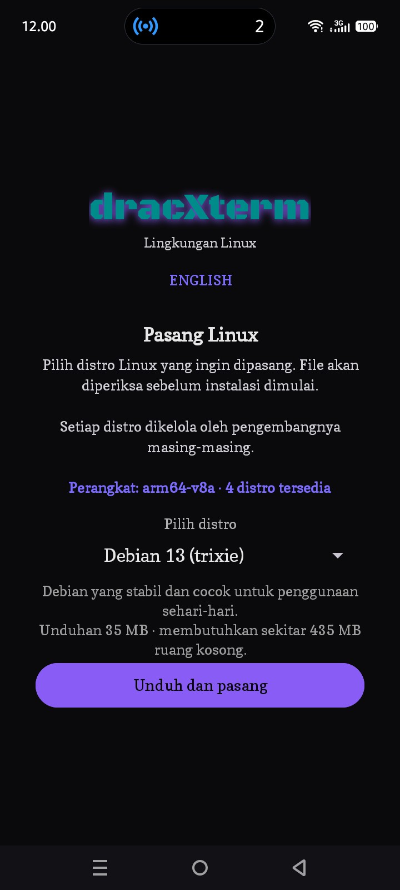
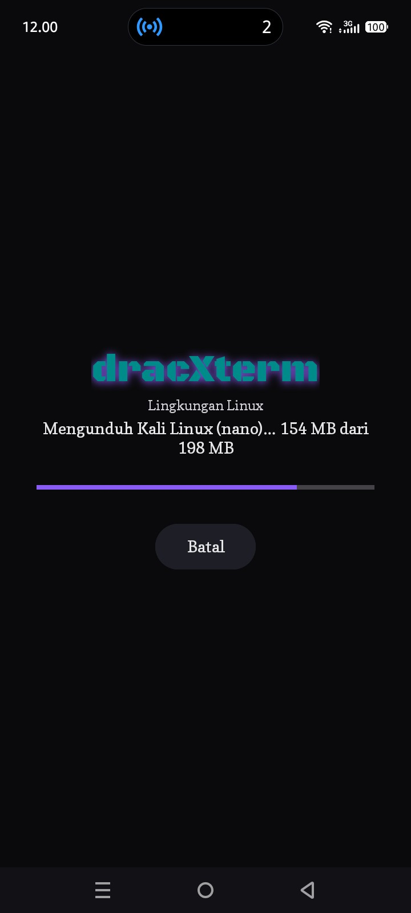
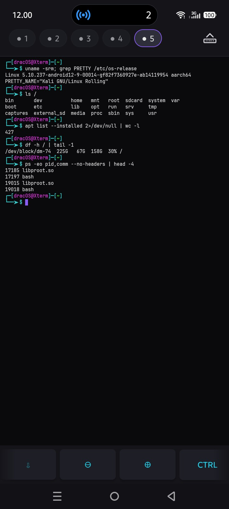
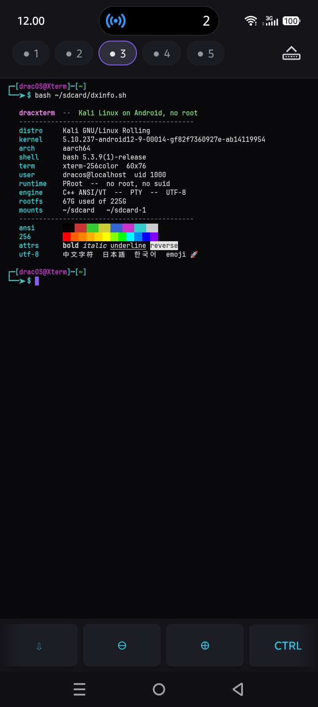
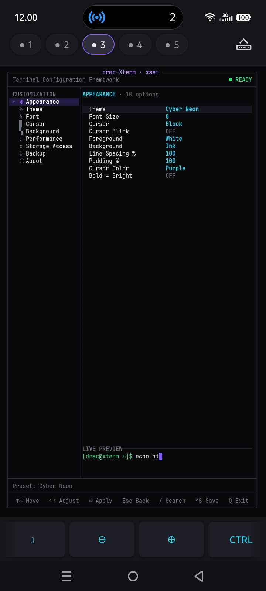
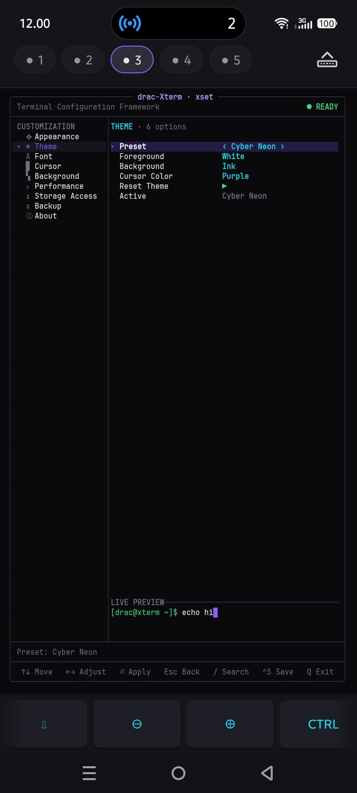
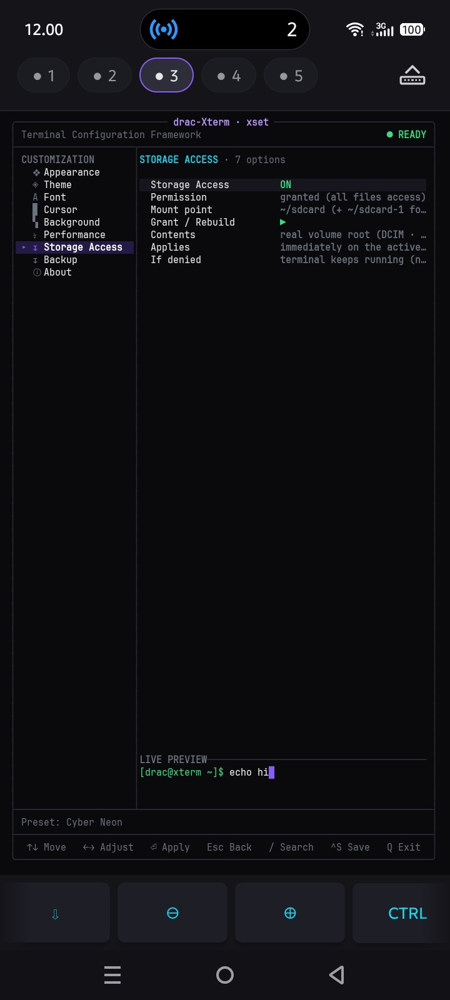
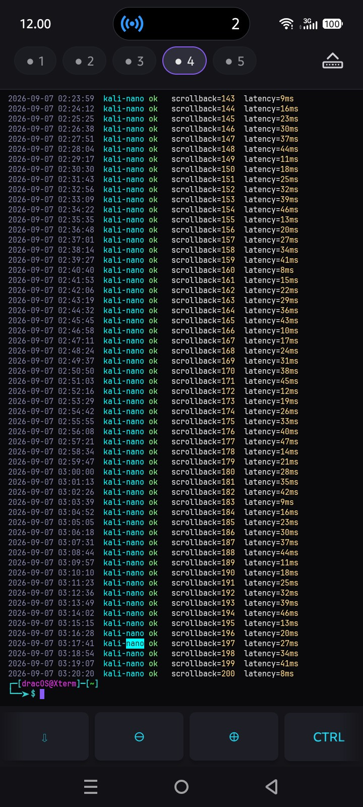

# dracxterm

Emulator terminal untuk Android ARM64. Mesin ANSI/VT, PTY, dan render UTF-8-nya
ditulis dari nol dengan C++; antarmukanya Kotlin. Tidak perlu root.

Bisa dipakai apa adanya sebagai shell BusyBox, atau menjalankan distribusi Linux
lewat PRoot di dalam sandbox aplikasi. Tujuannya satu: memberi shell yang benar
di ponsel, tanpa meminta root, akun, atau layanan apa pun.

## Screenshot

Diambil di Infinix X6726B, Android 15 (API 35), arm64-v8a, layar 720x1600,
dengan Kali Linux (nano) terpasang.

| | |
|---|---|
|  |  |
| 1. Layar pertama. Aplikasi membaca ABI perangkat dan hanya menampilkan image yang cocok, dengan ukuran unduhan dan ruang yang dibutuhkan. | 2. Pemasangan berjalan, dengan progres dalam MB dan tombol batal. Arsipnya dicocokkan SHA-256 sebelum diekstrak. |
|  |  |
| 3. Kali Linux berjalan lewat PRoot, tanpa root. Terlihat kernel Android yang dipakai dan proses proot yang menopang sesi. | 4. 16 warna ANSI, palet 256 warna, bold, italic, underline, reverse, dan UTF-8 penuh termasuk CJK dan emoji. |
|  |  |
| 5. `xset`, pengaturan yang digambar di dalam terminal itu sendiri. Halaman Appearance merangkum tema, font, kursor, dan padding. | 6. Preset tema. Perubahan warna langsung diterapkan ke terminal yang sedang jalan, lalu tersimpan otomatis. |
|  |  |
| 7. Sakelar akses penyimpanan. Izinnya tidak pernah diminta saat aplikasi dibuka, dan menyalakannya berlaku langsung di shell yang sedang jalan. | 8. Lima workspace terbuka sekaligus, masing-masing dengan shell dan riwayatnya sendiri. Scrollback berwarna dengan seleksi teks. |

## Yang bisa dilakukan

Terminalnya mendukung warna dan escape sequence ANSI/VT, scrollback, layar
alternatif, serta UTF-8 penuh termasuk karakter lebar CJK dan combining mark.
Ada seleksi teks, pencarian isi buffer, clipboard, bracketed paste, dan mouse
tracking untuk program yang memerlukannya.

Sampai lima workspace bisa dibuka sekaligus, masing-masing punya shell, PTY,
direktori kerja, dan riwayat sendiri. Berpindah antar workspace dengan usap.
Sesi tetap hidup saat aplikasi ditinggalkan, dijaga oleh foreground service.

Di bawah keyboard ada bar tombol tambahan yang bisa digulir: panah, gulir ke
dasar, zoom, Ctrl dan Alt yang bisa dikunci, Esc, Tab, Home, End, PgUp, PgDn,
pencarian, tempel, dan backspace. Cubit layar untuk mengubah ukuran font.

Ketik `xset` di terminal untuk membuka pengaturan. Semuanya digambar di dalam
terminal itu sendiri, dengan pratinjau langsung, dan tersimpan otomatis setiap
kali diubah:

| Menu | Isinya |
|---|---|
| Appearance | Ringkasan pengaturan yang paling sering dipakai, dalam satu layar. |
| Theme | Preset tema, warna foreground, background, dan cursor. |
| Font | JetBrains Mono atau font sistem, ukuran 7 sampai 28 dp, spasi baris, spasi huruf, padding, dan opsi bold sebagai warna terang. |
| Cursor | Bentuk block, bar, underline, atau hollow; kedip; warna. |
| Background | Warna latar dan kontras foreground-nya. |
| Performance | Kedalaman scrollback, 200 sampai 20000 baris. |
| Storage Access | Sakelar akses penyimpanan, berlaku langsung di shell yang sedang jalan. |
| Backup | Ekspor dan impor konfigurasi sebagai JSON, serta reset ke bawaan. |
| About | Informasi perangkat dan aplikasi, serta alamat kontak pengembang. |

Antarmukanya tersedia dalam Bahasa Indonesia dan Inggris. Toggle bahasanya ada
di dalam aplikasi, jadi kedua terjemahan selalu ikut terpasang.

Akses penyimpanan opsional dan tidak pernah diminta saat aplikasi dibuka. Kalau
diberikan, penyimpanan internal muncul di `~/sdcard`, dan volume lepas-pasang di
`~/sdcard-1` kalau memang ada. Kalau ditolak, semuanya tetap jalan.

Ollama bisa dipasang dari dalam terminal kalau Anda memintanya. Berkasnya tidak
ikut di dalam APK; yang diunduh adalah artefak rilis resmi Ollama v0.32.14-rc0,
sekitar 1,5 GB, yang dicocokkan SHA-256 sebelum dipasang.

Tidak ada analitik, iklan, pelacak, atau telemetri. Aplikasi membuka koneksi
hanya kalau Anda memintanya mengunduh sesuatu.

## Alur aplikasi

Bagian ini menjelaskan apa yang terjadi antara Anda menekan ikon aplikasi dan
sebuah prompt muncul. Berguna kalau ada yang gagal dan Anda ingin tahu di
langkah mana.

### Peluncuran pertama

Layar yang terbuka lebih dulu bukan terminal, melainkan layar provisioning. Ia
menyiapkan lingkungan Linux di belakang layar progres, dan menahan gestur back
selama proses berjalan supaya tidak ada instalasi yang terputus di tengah.

Yang pertama diperiksa: apakah sudah ada rootfs yang terpasang dan masih utuh.
Kalau ada, semua langkah di bawah dilewati dan aplikasi langsung membuka
terminal.

Kalau belum ada, langkah berikutnya ditentukan oleh apakah build ini membawa
image di dalam APK atau tidak. Jawabannya dibaca dari isi `assets/rootfs/` di
dalam APK, bukan dari nama berkas APK atau flag build:

- **Ada arsip di dalam APK.** Arsipnya langsung diekstrak. Tidak ada daftar
  distro, tidak ada panel persetujuan, dan tidak ada jaringan yang disentuh.
- **Tidak ada arsip.** Aplikasi menampilkan katalog dari
  `assets/rootfsURLS.json`, sudah disaring sesuai ABI perangkat, lengkap dengan
  ukuran unduhan dan ruang yang dibutuhkan tiap pilihan.

Sebelum itu, aplikasi juga memeriksa apakah ada arsip yang sudah pernah Anda
unduh dan tertinggal di direktori aplikasi. Kalau ada, pemasangan dilanjutkan
dari situ tanpa mengunduh ulang.

### Panel persetujuan

Tidak ada yang diunduh sampai Anda menekan tombolnya. Mengunduh adalah
satu-satunya alasan aplikasi ini membuka koneksi jaringan.

Menolak adalah pilihan yang sah, bukan kondisi error. Kalau Anda menolak,
aplikasi membuka terminal dengan shell BusyBox yang ikut di dalam APK, dan
terminal itu berfungsi penuh. Katalog distro bisa dibuka lagi kapan saja nanti.

### Unduhan

Unduhan hanya berjalan lewat HTTPS. Redirect yang menurunkan protokol ke
plaintext ditolak, tidak diikuti, karena berkas yang diunduh akan menjadi kode
yang dieksekusi di dalam sandbox Anda.

Byte-nya ditulis ke berkas `.part`, bukan langsung ke nama akhirnya. Nama akhir
baru dipakai setelah SHA-256 berkas lengkapnya cocok dengan digest yang dipin di
dalam APK. Akibatnya transfer yang terputus tidak pernah bisa disalahartikan
sebagai image yang siap pakai di peluncuran berikutnya.

Unduhan bisa dijeda dan dilanjutkan. Berkas `.part` yang tertinggal disambung
dengan Range request kalau server mendukungnya, dan diulang dari nol kalau
tidak. Menekan batal memutus koneksi saat itu juga, tanpa menunggu buffer yang
sedang dibaca selesai.

Kalau digest tidak cocok, arsipnya ditolak dan tidak ada yang diekstrak.

### Ekstraksi dan konfigurasi

Arsip yang lolos verifikasi diekstrak ke direktori privat aplikasi, lalu
dikonfigurasi: pengguna non-root di dalam guest, resolver DNS, dan titik masuk
shell-nya. Setelah itu isinya diperiksa sekali lagi, kali ini untuk memastikan
yang terpasang memang bisa dijalankan, bukan sekadar berhasil diekstrak.

Setelah ekstraksi sukses, arsip unduhannya dihapus untuk mengembalikan ruang.

Ada satu langkah pemulihan yang berjalan otomatis pada distro berbasis dpkg.
Karena login interaktif di dalam guest bukan root, state `apt` dan `dpkg` bisa
berakhir dimiliki user biasa, dan `dpkg` lalu menolak menulisnya bahkan lewat
`sudo`. Aplikasi merapikan kepemilikan itu, membersihkan lock yang tertinggal,
dan menyelesaikan transaksi yang sempat terputus. Langkah ini idempoten dan
tidak pernah menggagalkan boot; kalau gagal, terminal tetap terbuka dan
catatannya ditulis ke log di direktori aplikasi.

### Terminal

Sebelum shell dijalankan, aplikasi menyiapkan lingkungannya: symlink pustaka
yang dibutuhkan PRoot, dan beberapa ratus link applet BusyBox. Link itu dibuat
ulang setelah aplikasi diperbarui, karena pembaruan mengganti nama direktori
tempat biner-binernya tinggal, dan link lama akan menunjuk ke path yang sudah
tidak ada.

Perintah bawaannya `busybox ash`. Aplikasi berpindah ke PRoot sendiri begitu
rootfs terpasang, jadi tidak ada yang perlu Anda atur untuk pindah dari BusyBox
ke Debian atau Kali.

Sesi yang sudah jalan dijaga foreground service, sehingga shell dan PTY-nya
tetap hidup saat Anda pindah ke aplikasi lain.

### Ringkasan cabangnya

| Kondisi | Yang terjadi |
|---|---|
| Rootfs sudah ada dan utuh | Langsung ke terminal Linux |
| APK membawa image | Ekstrak offline, lalu terminal Linux |
| Arsip sudah pernah diunduh | Pasang dari arsip itu, lalu terminal Linux |
| Tidak ada arsip, belum ditolak | Tampilkan katalog dan tunggu keputusan Anda |
| Tidak ada arsip, tawaran ditolak | Terminal BusyBox, berfungsi penuh |
| Ada arsip tapi gagal dipasang | Berhenti dengan alasan yang jelas |

## Yang dibutuhkan

- Android 7.0 (API 24) atau lebih baru.
- Prosesor ARM64. APK hanya memuat biner `arm64-v8a`; perangkat 32-bit
  (`armeabi-v7a`) dan x86 tidak didukung.
- Ruang penyimpanan sesuai distro yang dipilih. Debian 13 butuh sekitar 520 MB
  setelah terpasang, Kali versi lengkap sekitar 9,5 GB.

Tidak butuh akun, layanan Google, atau akses root.

### Dependensi

Mesin terminalnya tidak memakai pustaka pihak ketiga. Parser ANSI/VT, buffer
layar, PTY, dan penanganan charset-nya ada di `app/src/main/cpp/`. Di sisi
Kotlin, aplikasi memakai:

| Pustaka | Untuk apa |
|---|---|
| `androidx.core:core-ktx`, `androidx.appcompat:appcompat` | Dasar activity, resource, dan pemilihan bahasa per aplikasi. |
| `com.google.android.material:material` | Komponen antarmuka. |
| `org.apache.commons:commons-compress` | Membaca arsip `.tar` saat mengekstrak rootfs. |
| `org.tukaani:xz` | Dekompresi `.tar.xz`, format semua image rootfs. |
| `com.github.luben:zstd-jni` | Dekompresi `.tar.zst`, format artefak rilis Ollama. |

Versi tiap pustaka ada di [`app/build.gradle.kts`](app/build.gradle.kts).

Lima biner ARM64 ikut dikirim di dalam APK: BusyBox, PRoot dan loader-nya,
talloc, dan libandroid-shmem. Rinciannya di
[Biner yang ikut dikirim](#biner-yang-ikut-dikirim).

## Versi dan paket

Rilis saat ini 1.0.1, `versionCode` 2, dengan `applicationId` `com.xdrac`.

Riwayat perubahan tiap rilis ada di [`CHANGELOG.md`](CHANGELOG.md).

## Unduh dan pasang

Ambil APK dari [Releases](https://github.com/ExsoKamabay/dxterm/releases).
Tiap berkas punya `.sha256` di sebelahnya. Periksa dulu sebelum memasang:

```bash
sha256sum -c dracxterm-1.0.1-vc2-release.apk.sha256
```

Lalu pasang lewat `adb`:

```bash
adb install -r dracxterm-1.0.1-vc2-release.apk
```

Atau salin APK ke perangkat dan buka dari file manager. Android akan meminta
izin memasang aplikasi dari sumber tidak dikenal.

## Memasang distro Linux

Saat pertama dibuka, aplikasi menampilkan daftar image yang cocok dengan ABI
perangkat, beserta ukuran unduhan dan ruang yang dibutuhkan. Setelah Anda
memilih dan menyetujui, aplikasi mengunduh arsipnya, mencocokkan SHA-256 dengan
digest yang sudah dipin di dalam APK, lalu mengekstraknya. Kalau digest tidak
cocok, arsip ditolak dan tidak diekstrak.

Sebelum ada distro yang terpasang, terminal tetap bisa dipakai memakai shell
BusyBox yang ikut di dalam APK.

Empat image tersedia untuk `arm64-v8a`:

| Distro | Unduhan | Terpasang | Sumber |
|---|---|---|---|
| Debian 13 (trixie) | 90 MB | 520 MB | `images.linuxcontainers.org` |
| Kali Linux (nano) | 198 MB | 1,0 GB | `kali.download` |
| Kali Linux (minimal) | 137 MB | 1,0 GB | `kali.download` |
| Kali Linux (full pentesting) | 1,8 GB | 9,5 GB | `kali.download` |

Debian 13 adalah pilihan default. URL, digest, dan catatan tiap image ada di
[`rootfsURLS.json`](app/src/main/assets/rootfsURLS.json), termasuk penjelasan
asal-usul tiap sumber.

Kedua sumber di atas menerbitkan `SHA256SUMS` sendiri, jadi digest yang dipin di
dalam APK bisa dicocokkan ulang dengan proyeknya masing-masing. Sebelum memotong
rilis, jalankan pemeriksaannya:

```bash
./scripts/verify-rootfs-urls.sh
```

Skrip itu membaca katalognya, memastikan tiap URL masih hidup dan ukurannya
belum berubah, lalu membandingkan tiap digest dengan `SHA256SUMS` upstream. Ada
satu hal yang perlu diawasi: server image linuxcontainers hanya menyimpan build
bertanggal sekitar tiga hari, jadi URL Debian akan berhenti resolve begitu build
itu dirotasi keluar. Digest-nya tetap berlaku di mana pun byte yang sama
disajikan, jadi memindahkannya ke mirror sendiri tidak mengubah apa yang
dipasang di perangkat.

## Izin Android

| Izin | Dipakai untuk |
|---|---|
| `INTERNET` | Mengunduh image rootfs yang Anda pilih, dan Ollama kalau Anda memintanya. |
| `ACCESS_NETWORK_STATE` | Memeriksa ada tidaknya jaringan sebelum unduhan dimulai. |
| `FOREGROUND_SERVICE`, `FOREGROUND_SERVICE_SPECIAL_USE` | Menjaga proses aplikasi, dan karenanya shell serta PTY-nya, tetap hidup saat Anda pindah ke aplikasi lain. |
| `POST_NOTIFICATIONS` | Hanya menentukan apakah notifikasi service terlihat. Tidak pernah diminta saat aplikasi dibuka; service dan shell-nya tidak bergantung pada izin ini. |
| `READ_EXTERNAL_STORAGE` (sampai API 32), `WRITE_EXTERNAL_STORAGE` (sampai API 29) | Akses penyimpanan bersama pada Android lama. Diabaikan atau otomatis di-scope pada API yang lebih baru. |
| `MANAGE_EXTERNAL_STORAGE` | Izin khusus, opsional, dan hanya aktif kalau Anda menyalakannya sendiri lewat Settings. Tujuannya supaya terminal bisa menjangkau penyimpanan bersama lewat path, seperti terminal Linux pada umumnya. Aplikasi tetap berfungsi penuh kalau izin ini ditolak. |

`MANAGE_EXTERNAL_STORAGE` adalah izin yang paling luas di daftar ini. Aplikasi
tidak pernah memintanya saat dibuka, dan tidak ada fitur yang mati tanpa izin
itu. Yang hilang hanya kemampuan membaca dan menulis berkas di luar direktori
milik aplikasi.

## Build

Bagian ini bisa diikuti dari mesin Linux yang belum pernah menyentuh Android
sama sekali. Urutannya: pasang perkakas, build debug untuk memastikan semuanya
jalan, siapkan keystore, lalu build release.

### Langkah 1: perkakas

JDK 17 dan Android SDK command-line tools. Android Studio tidak wajib.

```bash
java -version        # harus 17
```

Kalau `sdkmanager` belum ada, unduh command-line tools dari halaman Android
Studio, buka isinya, lalu tunjuk `ANDROID_HOME` ke folder SDK Anda:

```bash
export ANDROID_HOME="$HOME/Android/Sdk"
export PATH="$PATH:$ANDROID_HOME/cmdline-tools/latest/bin"
```

Pasang komponen yang dibutuhkan build ini:

```bash
sdkmanager "platforms;android-36" "build-tools;35.0.0" \
           "ndk;27.0.12077973" "cmake;3.22.1"
```

Versi NDK dan CMake dipin di [`app/build.gradle.kts`](app/build.gradle.kts),
jadi mesin siapa pun menghasilkan kode native yang sama. Angka versinya harus
persis; `sdkmanager` tidak akan memilihkan yang terdekat.

Simpan `ANDROID_HOME` supaya tidak hilang tiap kali shell ditutup, entah di
`~/.bashrc` atau di `local.properties` pada root repo:

```properties
sdk.dir=/home/anda/Android/Sdk
```

### Langkah 2: ambil sumbernya dan build debug

```bash
git clone https://github.com/ExsoKamabay/dxterm.git
cd dxterm
./gradlew assembleDebug
```

Build debug tidak butuh keystore, jadi ini cara tercepat memastikan JDK, SDK,
NDK, dan CMake sudah terpasang benar. Hasilnya
`app/build/outputs/apk/debug/app-debug.apk`, dan bisa langsung dipasang:

```bash
adb install -r app/build/outputs/apk/debug/app-debug.apk
```

Build pertama memakan waktu karena seluruh mesin terminal C++ dikompilasi dari
nol. Build berikutnya jauh lebih cepat.

Ada satu varian saja: `assembleDebug`, `assembleRelease`, dan `bundleRelease`.
Tidak ada product flavor.

### Langkah 3: jalankan tes mesin terminal

Suite C++ ini berjalan di komputer Anda, bukan di perangkat, dan tidak butuh SDK
maupun ponsel yang terhubung:

```bash
./native-tests/run-tests.sh
```

Jalankan setiap kali Anda menyentuh apa pun di `app/src/main/cpp/`.

### Langkah 4: siapkan keystore

Build release menolak jalan tanpa keystore, dan keystore-nya tidak boleh ada di
dalam repository. Kalau belum punya, buat satu di luar working tree:

```bash
mkdir -p ~/.android-keys
keytool -genkeypair -v \
        -keystore ~/.android-keys/dracxterm-release.jks \
        -alias dracxterm \
        -keyalg RSA -keysize 4096 -validity 10000
chmod 600 ~/.android-keys/dracxterm-release.jks
```

Simpan keystore itu dan kata sandinya baik-baik. Android memakai kunci
penandatangan sebagai identitas aplikasi: kalau kunci itu hilang, tidak ada
pembaruan yang bisa dipasang di atas versi yang sudah beredar.

Kredensialnya dibaca dari `~/.gradle/gradle.properties`, bukan dari repository:

```properties
DRACOS_STORE_FILE=/home/anda/.android-keys/dracxterm-release.jks
DRACOS_STORE_PASSWORD=...
DRACOS_KEY_ALIAS=dracxterm
DRACOS_KEY_PASSWORD=...
```

```bash
chmod 600 ~/.gradle/gradle.properties
```

Keempat properti itu juga bisa dikirim sebagai environment variable
`ORG_GRADLE_PROJECT_DRACOS_STORE_FILE` dan seterusnya. Kalau salah satu kosong,
Gradle menghentikan build release dan menyebut properti mana yang hilang.

Rilis ditandatangani dengan skema v2 dan v3, tanpa v1. Skema v3 membawa
certificate lineage, satu-satunya jalan merotasi kunci tanpa memutus pembaruan
untuk perangkat yang sudah memasang aplikasi.

### Langkah 5: naikkan versi

Untuk rilis baru, ubah dua angka di
[`app/build.gradle.kts`](app/build.gradle.kts):

```kotlin
versionCode = 2
versionName = "1.0.1"
```

`versionCode` hanya boleh naik dan tidak boleh dipakai ulang untuk unggahan
berbeda. Catat perubahannya di [`CHANGELOG.md`](CHANGELOG.md) dan di
`fastlane/metadata/android/*/changelogs/<versionCode>.txt`.

### Langkah 6: build APK release

```bash
./gradlew assembleRelease
```

Hasilnya `app/build/outputs/apk/release/app-release.apk`, sudah ditandatangani
dan sudah lewat `lintVitalRelease`. Periksa sebelum dipakai:

```bash
BT="$ANDROID_HOME/build-tools/35.0.0"
"$BT/apksigner" verify --print-certs app/build/outputs/apk/release/app-release.apk
"$BT/zipalign" -c -p 4 app/build/outputs/apk/release/app-release.apk
```

`apksigner` harus melaporkan skema v2 dan v3 sebagai `true`, dan `zipalign`
harus keluar tanpa pesan. APK inilah yang dipasang ke perangkat dan dilampirkan
ke GitHub Release.

### Langkah 7: build App Bundle release

```bash
./gradlew bundleRelease
```

Hasilnya `app/build/outputs/bundle/release/app-release.aab`. Format ini hanya
untuk diunggah ke Play Console; Android tidak bisa memasangnya langsung.
Validasi dengan [bundletool](https://github.com/google/bundletool):

```bash
bundletool validate --bundle=app/build/outputs/bundle/release/app-release.aab
```

Bundle-nya sengaja tidak memecah resource per bahasa, karena aplikasi punya
toggle bahasa sendiri dan kedua terjemahan harus selalu ada di perangkat.

Untuk mencoba hasil bundle di perangkat, `bundletool` bisa menurunkannya jadi
APK set:

```bash
bundletool build-apks --bundle=app/build/outputs/bundle/release/app-release.aab \
                      --output=/tmp/dracxterm.apks --local-testing
bundletool install-apks --apks=/tmp/dracxterm.apks
```

### Membangun keduanya sekaligus

`scripts/release-build.sh` menjalankan langkah 6 dan 7 dalam satu perintah:
build APK dan AAB, verifikasi tanda tangan dan alignment, validasi bundle, lalu
menyalin keduanya ke `apps/` dengan nama berversi dan berkas `.sha256`
masing-masing.

```bash
./scripts/release-build.sh
```

`apps/` ada di `.gitignore` dan tidak pernah ikut ter-commit.

### Membawa image rootfs di dalam APK

Yang menentukan jenis installer adalah isi `app/src/main/assets/rootfs/`:

| Isi folder itu saat build | Hasil |
|---|---|
| Tidak ada arsip (boleh ada `README.txt`) | APK tidak membawa image. Saat pertama dibuka aplikasi menampilkan katalog distro dan mengunduh pilihan Anda. |
| Tepat satu arsip | Arsipnya ikut dikemas. Saat pertama dibuka aplikasi langsung mengekstraknya, tanpa daftar distro dan tanpa jaringan. |
| Lebih dari satu arsip | Build gagal dan menyebut nama berkas yang ditemukan. |

Format yang dikenali: `.tar.xz`, `.txz`, `.tar.gz`, `.tgz`, dan `.tar`. Berkas
lain seperti `README.txt` diabaikan.

Untuk build yang membawa image, ambil dulu arsipnya. Arsip itu tidak ikut di
repo:

```bash
./scripts/fetch-rootfs.sh --list          # lihat pilihan
./scripts/fetch-rootfs.sh                 # ambil yang default
./gradlew assembleRelease                 # sekarang membawa image
```

Untuk kembali ke build tanpa image, kosongkan lagi folder itu dengan
`./scripts/fetch-rootfs.sh --clear`.

### Pemeriksaan lain

`scripts/verify-metadata.py` memeriksa hal-hal yang bisa diperiksa mesin:
identitas aplikasi, panjang teks Fastlane, ukuran dan rasio screenshot, serta
apakah ada material penandatanganan atau artefak build yang ikut terlacak Git.

```bash
python3 scripts/verify-metadata.py
./scripts/verify-rootfs-urls.sh           # cocokkan digest katalog dengan sumbernya
```

## Biner yang ikut dikirim

APK memuat lima biner ARM64: BusyBox, PRoot dan loader-nya, talloc, dan
libandroid-shmem. Semuanya dibangun dari sumber oleh `prebuilts/build.sh` dari
revisi upstream yang dipin. Hasilnya reproducible: digest yang sama keluar dari
direktori build mana pun.

Versi upstream, lisensi, dan written offer untuk source code-nya ada di
[`NOTICE`](NOTICE). Resep build tiap biner ada di
[`prebuilts/`](prebuilts/README.md).

## Keterbatasan yang diketahui

- **ARM64 saja.** Perangkat `armeabi-v7a` dan x86 tidak didukung karena biner
  yang ikut dikirim hanya dibangun untuk `arm64-v8a`.
- **Backup Android aktif.** `android:allowBackup` masih `true` dan aplikasi
  belum punya aturan pengecualian. Artinya data aplikasi, termasuk isi rootfs
  dan riwayat shell, bisa ikut terbawa oleh backup atau transfer perangkat.
  Matikan backup untuk aplikasi ini lewat Settings kalau Anda mengetik hal
  sensitif di terminal.
- **URL Debian berumur pendek.** `images.linuxcontainers.org` hanya menyimpan
  build bertanggal sekitar tiga hari, jadi URL Debian di katalog berhenti
  resolve setelah build itu dirotasi keluar, dan pemasangan Debian gagal sampai
  katalognya dipindah ke mirror sendiri. Kali tidak punya masalah ini.
- **Tidak ada unit test JVM dan tidak ada CI di repo ini.** Yang tersedia hanya
  suite C++ untuk mesin terminal di `native-tests/` dan lint Android.
- **Ollama berjalan lewat PRoot**, jadi kecepatannya di bawah biner native.

## Lisensi

Apache-2.0, lihat [`LICENSE`](LICENSE).

Biner pihak ketiga punya lisensinya sendiri: GPL-2.0 untuk BusyBox dan PRoot,
LGPL-3.0 untuk talloc, dan BSD-3-Clause untuk libandroid-shmem. Font JetBrains
Mono, Copse, dan Black Ops One memakai SIL Open Font License 1.1. Teks
lengkapnya ada di [`licenses/`](licenses/) dan rinciannya di
[`NOTICE`](NOTICE), termasuk written offer untuk source code biner GPL.

Image Linux yang diunduh tunduk pada lisensi distribusinya masing-masing, bukan
pada lisensi dracxterm.
