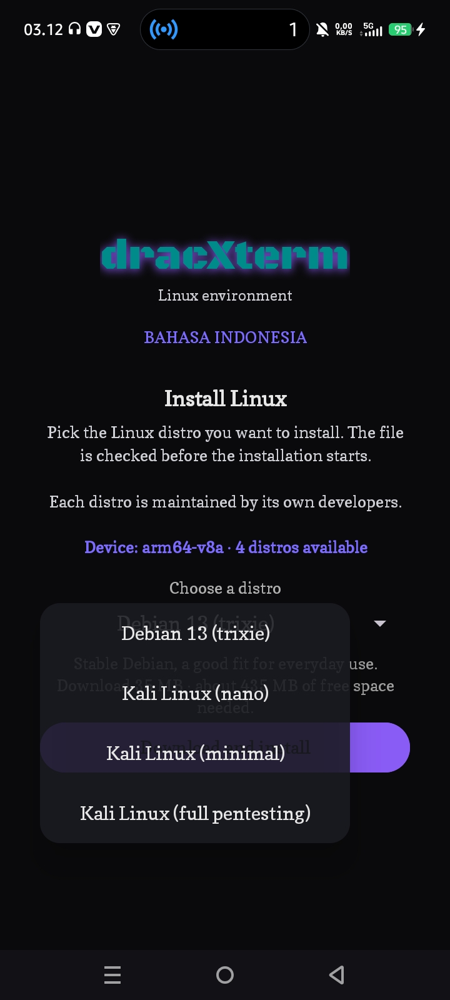
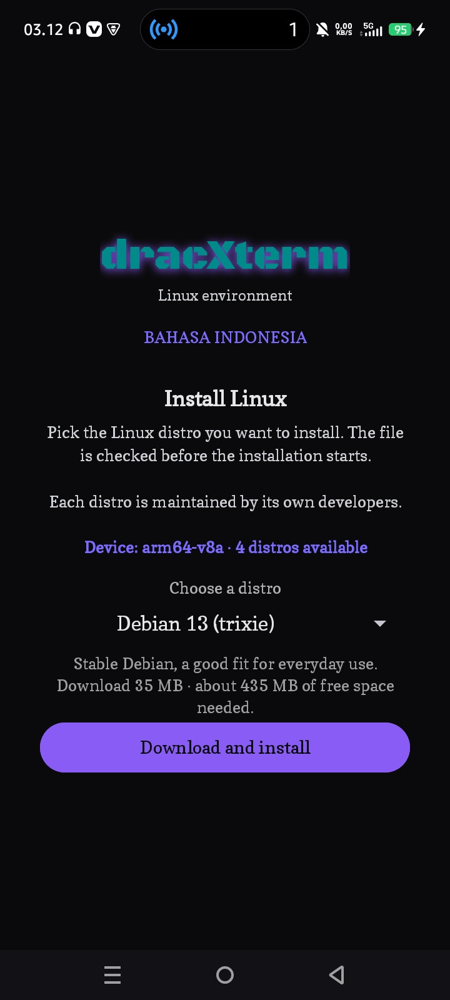
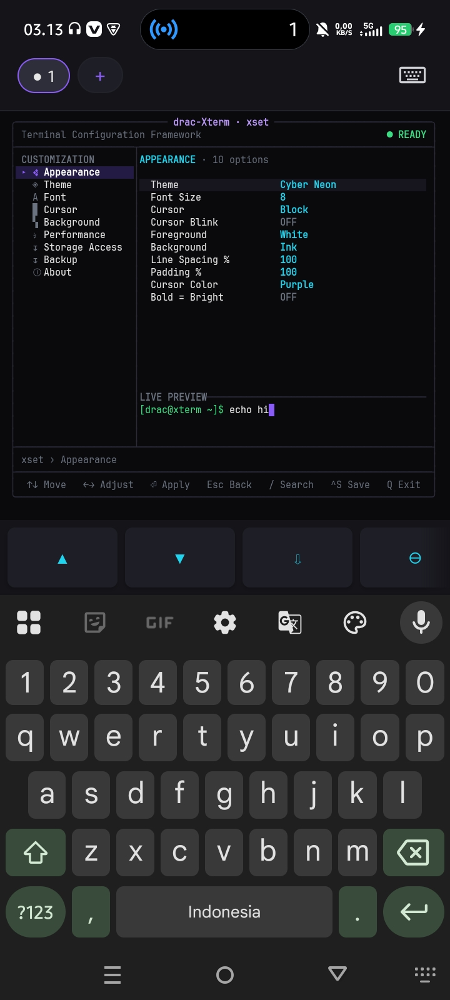
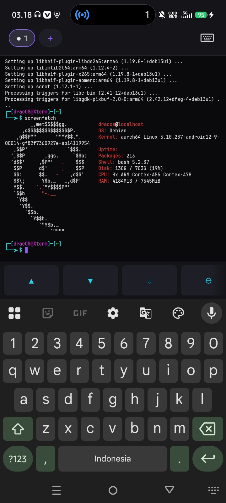

# dracxterm

Emulator terminal untuk Android ARM64. Mesin ANSI/VT, PTY, dan render UTF-8-nya
ditulis dari nol dengan C++; antarmukanya Kotlin. Tidak perlu root.

Bisa dipakai apa adanya sebagai shell BusyBox, atau menjalankan distribusi Linux
lewat PRoot di dalam sandbox aplikasi.

## Screenshot

| | |
|---|---|
|  |  |
| 1. Pemilihan distro. Aplikasi membaca ABI perangkat dan hanya menampilkan image yang cocok. | 2. Layar instalasi Debian 13, dengan ukuran unduhan dan ruang penyimpanan yang dibutuhkan. |
|  |  |
| 3. `xset`, pengaturan tampilan terminal dengan pratinjau langsung. | 4. Debian berjalan di dalam terminal, dilihat lewat `screenfetch`. |

## Yang dibutuhkan

- Android 7.0 (API 24) atau lebih baru.
- Prosesor ARM64. APK hanya memuat biner `arm64-v8a`; perangkat 32-bit
  (`armeabi-v7a`) dan x86 tidak didukung.
- Ruang penyimpanan sesuai distro yang dipilih. Debian 13 butuh sekitar 400 MB
  setelah terpasang, Kali versi lengkap sekitar 9,5 GB.

## Versi dan paket

Rilis saat ini 1.0.0, `versionCode` 1, dengan `applicationId` `com.xdrac`.

Paket itu berbeda dari `com.dracxterm` yang dipakai versi lama, jadi Android
memperlakukan keduanya sebagai aplikasi terpisah. Memasang yang baru tidak
menimpa yang lama, dan data yang lama tidak ikut pindah.

## Unduh dan pasang

Ambil APK dari [Releases](https://github.com/ExsoKamabay/dxterm/releases).
Tiap berkas punya `.sha256` di sebelahnya. Periksa dulu sebelum memasang:

```bash
sha256sum -c dracxterm-1.0.0-vc1-release.apk.sha256
```

Lalu pasang lewat `adb`:

```bash
adb install -r dracxterm-1.0.0-vc1-release.apk
```

Atau salin APK ke perangkat dan buka dari file manager. Android akan meminta
izin memasang aplikasi dari sumber tidak dikenal.

## Memasang distro Linux

Saat pertama dibuka, aplikasi menampilkan daftar image yang cocok dengan ABI
perangkat, beserta ukuran unduhan dan ruang yang dibutuhkan. Setelah Anda
memilih dan menyetujui, aplikasi mengunduh arsipnya, mencocokkan SHA-256 dengan
digest yang sudah dipin di dalam APK, lalu mengekstraknya. Kalau digest tidak
cocok, arsip ditolak dan tidak diekstrak.

Sebelum ada distro yang terpasang, terminal tetap bisa dipakai memakai shell
BusyBox yang ikut di dalam APK.

Empat image tersedia untuk `arm64-v8a`:

| Distro | Unduhan | Terpasang | Sumber |
|---|---|---|---|
| Debian 13 (trixie) | 35 MB | 400 MB | `easycli.sh` |
| Kali Linux (nano) | 198 MB | 1,0 GB | `kali.download` |
| Kali Linux (minimal) | 137 MB | 1,0 GB | `kali.download` |
| Kali Linux (full pentesting) | 1,8 GB | 9,5 GB | `kali.download` |

Debian 13 adalah pilihan default. URL, digest, dan catatan tiap image ada di
[`rootfsURLS.json`](app/src/main/assets/rootfsURLS.json), termasuk penjelasan
soal asal-usul tiap sumber.

## Yang bisa dilakukan

Warna dan escape sequence ANSI/VT, scrollback, layar alternatif, dan UTF-8 penuh
termasuk CJK. Seleksi teks, pencarian isi buffer, clipboard, bracketed paste,
dan mouse tracking.

Sampai lima workspace, masing-masing punya shell, PTY, direktori kerja, dan
riwayat sendiri. Sesi tetap hidup saat aplikasi ditinggalkan, dijaga oleh
foreground service.

Ketik `xset` di terminal untuk mengatur tema, font, ukuran teks, bentuk cursor,
warna, dan scrollback. Semuanya digambar di dalam terminal itu sendiri, dengan
pratinjau langsung.

Antarmukanya tersedia dalam Bahasa Indonesia dan Inggris. Toggle bahasanya ada
di dalam aplikasi, jadi kedua terjemahan selalu ikut terpasang.

Akses penyimpanan opsional dan tidak pernah diminta saat aplikasi dibuka. Kalau
diberikan, penyimpanan internal muncul di `~/sdcard`. Kalau ditolak, semuanya
tetap jalan.

Ollama bisa dipasang dari dalam terminal kalau Anda memintanya. Berkasnya tidak
ikut di dalam APK dan diambil dari artefak rilis resmi Ollama.

Tidak ada analitik, iklan, pelacak, atau telemetri. Aplikasi membuka koneksi
hanya kalau Anda memintanya mengunduh sesuatu.

## Izin Android

| Izin | Dipakai untuk |
|---|---|
| `INTERNET` | Mengunduh image rootfs yang Anda pilih, dan Ollama kalau Anda memintanya. |
| `ACCESS_NETWORK_STATE` | Memeriksa ada tidaknya jaringan sebelum unduhan dimulai. |
| `FOREGROUND_SERVICE`, `FOREGROUND_SERVICE_SPECIAL_USE` | Menjaga proses aplikasi, dan karenanya shell serta PTY-nya, tetap hidup saat Anda pindah ke aplikasi lain. |
| `POST_NOTIFICATIONS` | Hanya menentukan apakah notifikasi service terlihat. Tidak pernah diminta saat aplikasi dibuka; service dan shell-nya tidak bergantung pada izin ini. |
| `READ_EXTERNAL_STORAGE` (sampai API 32), `WRITE_EXTERNAL_STORAGE` (sampai API 29) | Akses penyimpanan bersama pada Android lama. Diabaikan atau otomatis di-scope pada API yang lebih baru. |
| `MANAGE_EXTERNAL_STORAGE` | Izin khusus, opsional, dan hanya aktif kalau Anda menyalakannya sendiri lewat Settings. Tujuannya supaya terminal bisa menjangkau penyimpanan bersama lewat path, seperti terminal Linux pada umumnya. Aplikasi tetap berfungsi penuh kalau izin ini ditolak. |

`MANAGE_EXTERNAL_STORAGE` adalah izin yang paling luas di daftar ini. Aplikasi
tidak pernah memintanya saat dibuka, dan tidak ada fitur yang mati tanpa izin
itu. Yang hilang hanya kemampuan membaca dan menulis berkas di luar direktori
milik aplikasi.

## Build

Perlu JDK 17 dan Android SDK command-line tools. Android Studio tidak wajib.

```bash
export ANDROID_HOME="/path/ke/Android/Sdk"
sdkmanager "platforms;android-36" "build-tools;35.0.0" \
           "ndk;27.0.12077973" "cmake;3.22.1"

./gradlew assembleDebug
```

Ada satu varian saja: `assembleDebug`, `assembleRelease`, dan `bundleRelease`.
Tidak ada product flavor.

Build release menolak jalan tanpa keystore. Kredensialnya dibaca dari
`~/.gradle/gradle.properties` dan keystore-nya disimpan di luar repository:

```properties
DRACOS_STORE_FILE=/path/ke/keystore.jks
DRACOS_STORE_PASSWORD=...
DRACOS_KEY_ALIAS=...
DRACOS_KEY_PASSWORD=...
```

Di CI, kirim keempatnya sebagai environment variable `ORG_GRADLE_PROJECT_DRACOS_*`.

Yang menentukan jenis installer adalah isi `app/src/main/assets/rootfs/`:

| Isi folder itu saat build | Hasil |
|---|---|
| Tidak ada arsip (boleh ada `README.txt`) | APK tidak membawa image. Saat pertama dibuka aplikasi menampilkan katalog distro dan mengunduh pilihan Anda. |
| Tepat satu arsip | Arsipnya ikut dikemas. Saat pertama dibuka aplikasi langsung mengekstraknya, tanpa daftar distro dan tanpa jaringan. |
| Lebih dari satu arsip | Build gagal dan menyebut nama berkas yang ditemukan. |

Format yang dikenali: `.tar.xz`, `.txz`, `.tar.gz`, `.tgz`, dan `.tar`. Berkas
lain seperti `README.txt` diabaikan.

Untuk build yang membawa image, ambil dulu arsipnya. Arsip itu tidak ikut di
repo:

```bash
./scripts/fetch-rootfs.sh --list          # lihat pilihan
./scripts/fetch-rootfs.sh                 # ambil yang default
./gradlew assembleDebug                   # sekarang membawa image
```

Uji mesin terminalnya. Ini tidak butuh SDK maupun perangkat:

```bash
./native-tests/run-tests.sh
```

## Biner yang ikut dikirim

APK memuat lima biner ARM64: BusyBox, PRoot dan loader-nya, talloc, dan
libandroid-shmem. Semuanya dibangun dari sumber oleh `prebuilts/build.sh` dari
revisi upstream yang dipin. Hasilnya reproducible: digest yang sama keluar dari
direktori build mana pun.

Versi upstream, lisensi, dan written offer untuk source code-nya ada di
[`NOTICE`](NOTICE). Resep build tiap biner ada di
[`prebuilts/`](prebuilts/README.md).

## Keterbatasan yang diketahui

- **ARM64 saja.** Perangkat `armeabi-v7a` dan x86 tidak didukung karena biner
  yang ikut dikirim hanya dibangun untuk `arm64-v8a`.
- **Backup Android aktif.** `android:allowBackup` masih `true` dan aplikasi
  belum punya aturan pengecualian. Artinya data aplikasi, termasuk isi rootfs
  dan riwayat shell, bisa ikut terbawa oleh backup atau transfer perangkat.
  Matikan backup untuk aplikasi ini lewat Settings kalau Anda mengetik hal
  sensitif di terminal.
- **Provenance image Debian lebih lemah dari Kali.** Kali menerbitkan
  `SHA256SUMS` sendiri, jadi digest-nya bisa diturunkan ulang dari sumber
  resminya. Image Debian datang dari mirror pihak ketiga `easycli.sh`, dan
  digest-nya sudah tidak bisa dicocokkan dengan otoritas independen. Digest
  yang dipin tetap menahan substitusi di kemudian hari, tapi rantai
  kepercayaannya lebih pendek.
- **Tidak ada unit test JVM dan tidak ada CI di repo ini.** Yang tersedia hanya
  suite C++ untuk mesin terminal di `native-tests/` dan lint Android.
- **Ollama berjalan lewat PRoot**, jadi kecepatannya di bawah biner native.

## Lisensi

Apache-2.0, lihat [`LICENSE`](LICENSE).

Biner pihak ketiga punya lisensinya sendiri: GPL-2.0 untuk BusyBox dan PRoot,
LGPL-3.0 untuk talloc, dan BSD-3-Clause untuk libandroid-shmem. Font JetBrains
Mono, Copse, dan Black Ops One memakai SIL Open Font License 1.1. Teks
lengkapnya ada di [`licenses/`](licenses/) dan rinciannya di
[`NOTICE`](NOTICE), termasuk written offer untuk source code biner GPL.

Image Linux yang diunduh tunduk pada lisensi distribusinya masing-masing, bukan
pada lisensi dracxterm.
