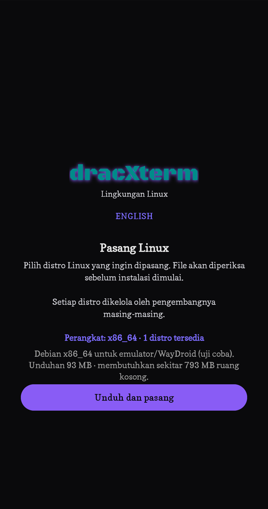
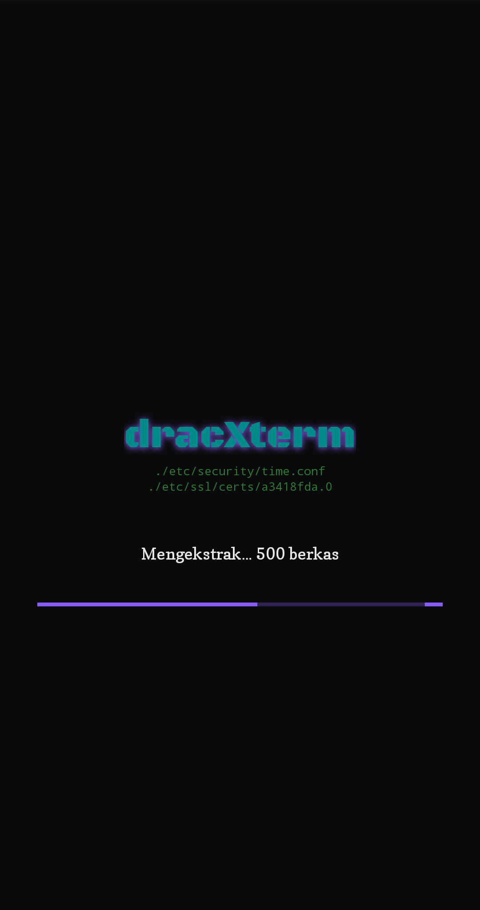
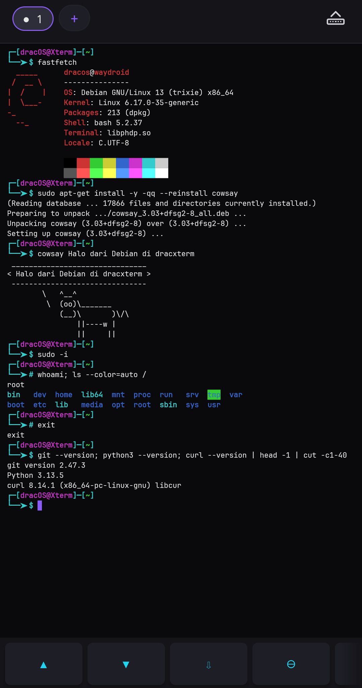
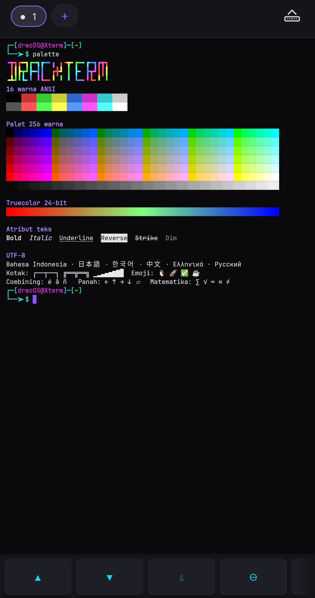
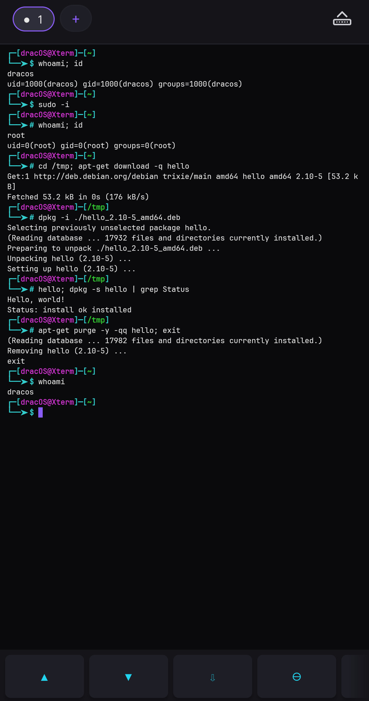
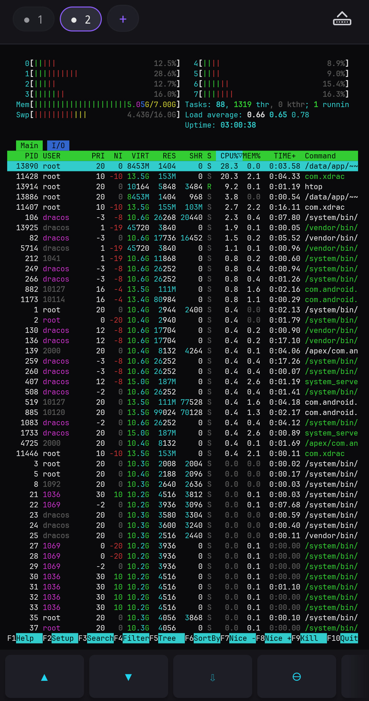
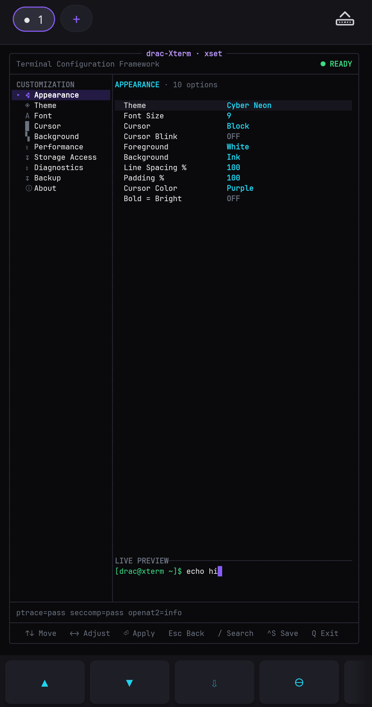
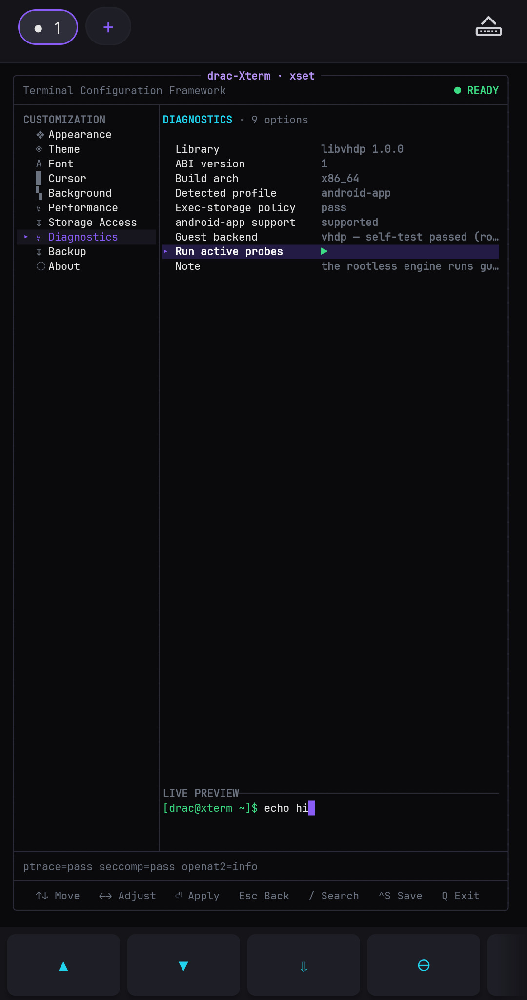
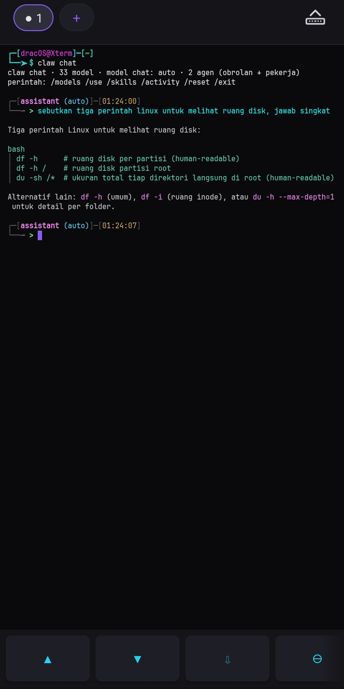
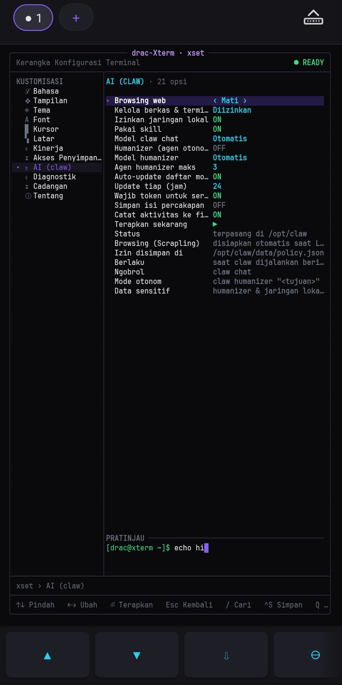

# dracxterm

[Website](https://exsokamabay.github.io/dxterm/) · [English](README.en.md) · [Download APK](https://github.com/ExsoKamabay/dxterm/releases/latest)

dracxterm adalah terminal untuk Android. Begitu dibuka, Anda sudah bisa
mengetik perintah. Kalau mau lebih jauh, aplikasi ini bisa memasang Linux di
dalam ruang penyimpanannya sendiri, lalu Anda bekerja seperti di komputer.

Ponsel tidak perlu di-root. Tidak ada akun yang harus dibuat, dan tidak ada
layanan yang harus dipasang lebih dulu.

Setelah distro terpasang, Anda juga mendapat `claw`, asisten yang bisa diajak
mengobrol dan disuruh bekerja di terminal. Ia memakai model bahasa gratis dari
internet, dan Anda yang menentukan apa saja yang boleh ia sentuh.

## Screenshot

| | |
|---|---|
|  |  |
| 1. Layar pertama. Aplikasi membaca ABI perangkat dan hanya menampilkan image yang cocok, dengan ukuran unduhan dan ruang yang dibutuhkan. | 2. Pemasangan berjalan. Arsipnya sudah lolos pemeriksaan SHA-256 dan sedang diekstrak, dengan pratinjau berkas yang sedang ditulis. |
|  |  |
| 3. Debian 13 berjalan lewat VHDP, tanpa root: `fastfetch`, `sudo apt-get install`, sesi root, git, Python, dan curl. | 4. 16 warna ANSI, palet 256 warna, truecolor 24-bit, atribut teks, dan UTF-8 penuh termasuk CJK, emoji, dan combining mark. |
|  |  |
| 5. `sudo -i` menjadi root, lalu paket `.deb` diunduh, dipasang dengan `dpkg -i`, dijalankan, dan dihapus. `exit` kembali ke user biasa. | 6. `htop` layar penuh di workspace kedua. Tiap workspace punya shell dan PTY sendiri. |
|  |  |
| 7. `xset`, pengaturan yang digambar di dalam terminal. Halaman Appearance merangkum tema, font, kursor, dan padding. | 8. Halaman Diagnostics: mesin yang sedang menjalankan sesi Linux, dan tombol untuk menjalankan pemeriksaan. |
|  |  |
| 9. `claw chat` di 1.1.0: pertanyaan biasa, jawaban di terminal yang sama. Saat diuji ada 33 model gratis yang bisa dipakai. | 10. Halaman AI (claw) di `xset`, menu berbahasa Indonesia. Tiap baris menentukan apa yang boleh dilakukan claw. |

## Yang baru di 1.1.0

Perubahan terbesar dibanding 1.0.6 adalah `claw`. Ketik `claw chat` di distro
yang sudah terpasang, lalu tulis permintaan dengan kalimat biasa. Jawabannya
muncul di terminal yang sama, dan selama menunggu, layar menunjukkan apa yang
sedang dikerjakan, misalnya berkas mana yang sedang ditulis. Tidak perlu akun:
claw memakai layanan model gratis yang bisa dipakai tanpa daftar, dan pindah ke
model lain sendiri kalau satu model sedang penuh. Penjelasan lengkapnya ada di
[Asisten claw](#asisten-claw).

`claw humanizer "tujuan"` menjalankan beberapa agen untuk satu tujuan besar dan
terus bekerja sampai Anda mematikannya. Aktivitasnya bisa diikuti langsung di
tab yang dibuka aplikasi untuk Anda.

Pengaturan `xset` mendapat dua halaman baru. AI (claw) mengatur apa yang boleh
dilakukan claw, dengan bawaan yang hati-hati: akses berkas dan perintah mati,
dan membuka internet harus minta izin dulu. Bahasa mengganti bahasa semua menu
`xset` ke Indonesia, English, 中文, Tiếng Việt, Русский, atau हिन्दी. Bawaannya
Bahasa Indonesia, jadi kalau dulu Anda membaca menu `xset` dalam bahasa Inggris,
pilih English di halaman itu.

Beberapa perintah yang dulu gagal sekarang jalan. `sudo nmap` dan
`nmap -sn 192.168.1.0/24` memindai, tidak lagi berhenti di galat socket.
`sudo` berhenti mengeluh soal nama host. Memasang paket yang membawa layanan,
seperti `openssh-server`, selesai tanpa galat. `date` menunjukkan jam ponsel,
bukan UTC.

Mengetik dan menggulir juga lebih enak. Papan ketik fisik mengirim Ctrl, Alt,
Shift, dan F1 sampai F12 dengan benar. Anda bisa menggulir ke atas dan membaca
riwayat saat program masih mencetak. Tombol Back menutup `xset`, tidak lagi
menutup aplikasi. Ctrl atau Alt dari baris tombol tambahan tidak tertinggal
setelah menempel atau zoom.

Ada harga yang perlu Anda tahu. APK-nya sekarang sekitar 33 MB, dari 14 MB.
Setelah distro terpasang, aplikasi mengunduh Python dan Scrapling di latar
supaya claw bisa membuka halaman web, kecuali Browsing dimatikan di `xset claw`.
Pesan yang Anda tulis ke claw dikirim ke layanan model pihak lain. Rinciannya di
[Keterbatasan yang diketahui](#keterbatasan-yang-diketahui), dan catatan lengkap
tiap rilis ada di [`CHANGELOG.md`](CHANGELOG.md).

## Yang bisa dilakukan

Terminalnya menangani warna, kursor, scrollback, dan layar alternatif yang
dipakai program layar penuh seperti nano, vim, atau htop. Teks UTF-8 tampil
benar, termasuk aksara lebar seperti CJK. Anda bisa memilih teks, mencari isi
layar, menyalin, dan menempel. Program yang memakai mouse juga bekerja.

Sampai lima ruang kerja bisa dibuka sekaligus. Masing-masing punya shell,
direktori kerja, dan riwayat sendiri, dan Anda berpindah dengan mengusap layar.
Sesi tetap hidup saat Anda pindah ke aplikasi lain.

Di bawah papan ketik ada baris tombol tambahan yang bisa digeser: panah, gulir
ke dasar, zoom, Ctrl dan Alt yang bisa dikunci, Esc, Tab, Home, End, PgUp,
PgDn, cari, tempel, dan backspace. Cubit layar untuk memperbesar huruf.

Ketik `xset` untuk membuka pengaturan. Semuanya digambar di dalam terminal,
berubah langsung saat Anda geser, dan tersimpan sendiri. Nama menunya mengikuti
bahasa yang dipilih di halaman Bahasa; di bawah ini nama bawaannya, dengan nama
Inggris di dalam kurung:

| Menu | Isinya |
|---|---|
| Bahasa (Language) | Bahasa menu `xset`: Indonesia, English, 中文, Tiếng Việt, Русский, atau हिन्दी. |
| Tampilan (Appearance) | Pengaturan yang paling sering dipakai, dalam satu layar. |
| Tema (Theme) | Preset tema, warna teks, latar, dan kursor. |
| Font | JetBrains Mono atau font sistem, ukuran 7 sampai 28 dp, jarak baris, jarak huruf, dan padding. |
| Kursor (Cursor) | Bentuk block, bar, underline, atau hollow; kedip; warna. |
| Latar (Background) | Warna latar dan kontras teksnya. |
| Kinerja (Performance) | Panjang scrollback, 200 sampai 20000 baris. |
| Akses Penyimpanan (Storage Access) | Sakelar akses penyimpanan, berlaku langsung di shell yang sedang jalan. |
| AI (claw) | Apa yang boleh dilakukan claw, model yang dipakai, dan mode Humanizer. |
| Diagnostik (Diagnostics) | Keterangan mesin yang menjalankan sesi Linux, dan tombol untuk memeriksanya. |
| Cadangan (Backup) | Ekspor dan impor pengaturan sebagai JSON, serta kembali ke bawaan. |
| Tentang (About) | Keterangan perangkat dan aplikasi, serta alamat kontak. |

`xset theme`, `xset claw`, `xset vhdp`, dan seterusnya langsung membuka halaman
yang disebut. Back menutup `xset`.

Di dalam distro Anda masuk sebagai pengguna biasa bernama `dracos`.
`sudo PERINTAH`, `su -c PERINTAH`, dan `fakeroot PERINTAH` menjalankan satu
perintah sebagai root. `sudo -i`, `sudo -s`, `su`, `su -`, dan `sudo su` membuka
shell root dengan prompt `#`, dan `exit` mengembalikan Anda ke `dracos`. Root di
sini hanya berlaku di dalam aplikasi, bukan root ponsel, tetapi cukup untuk
`apt-get install`, `dpkg -i paket.deb`, menulis ke `/etc` atau `/usr`, dan
`chown`.

Layar aplikasi tersedia dalam Bahasa Indonesia dan Inggris, dan tombol gantinya
ada di dalam aplikasi, jadi kedua bahasa selalu ikut terpasang. Menu `xset`
punya pilihan bahasanya sendiri, enam bahasa, di halaman Bahasa.

Aplikasi tidak pernah meminta akses penyimpanan ponsel saat dibuka. Anda yang
menyalakannya, lewat `xset`, dan saat itu juga penyimpanan internal muncul di
`~/sdcard` pada shell yang sedang jalan, kartu SD di `~/sdcard-1` bila ada. Kalau
tidak dinyalakan, semuanya tetap jalan.

Ollama bisa dipasang dari dalam terminal kalau Anda memintanya. Berkasnya tidak
ikut di dalam APK: yang diunduh adalah rilis resmi Ollama v0.34.2, sekitar 1,5 GB,
dan berkasnya diperiksa dulu sebelum dipasang. Hanya untuk ponsel arm64.

Tidak ada analitik, iklan, pelacak, atau telemetri, dan tidak ada data yang
dikirim ke pengembang. Aplikasi membuka jaringan untuk tiga hal: mengunduh distro
atau Ollama yang Anda pilih, menyiapkan Python dan Scrapling untuk claw setelah
distro terpasang (bisa dimatikan), dan mengirim pesan Anda ke layanan model
ketika Anda memakai claw.

### Asisten claw

`claw` adalah perintah di dalam distro. Ia tidak ada di terminal tanpa distro;
di sana perintah itu hanya menjelaskan bahwa ia butuh distro.

```bash
claw chat                          # mengobrol dan memberi perintah; /exit untuk keluar
claw browse https://example.com    # ambil isi halaman web
claw humanizer "tujuan"            # beberapa agen bekerja terus untuk satu tujuan
claw watch                         # laporan aktivitas yang bergerak langsung
claw models                        # daftar model yang sedang dipakai
claw skills                        # skill yang bisa dipakai model
claw doctor                        # periksa lingkungan kalau ada yang tidak jalan
```

Pertanyaan Anda dikirim ke layanan model gratis yang bisa dipakai tanpa akun:
LLM7, Kilo Gateway, Pollinations, OVHcloud AI Endpoints, dan OpenCode Zen. Kalau
satu model sedang penuh atau rusak, claw pindah ke model lain. Selama claw
dipakai, daftar modelnya diperbarui sekali sehari: model yang rusak dibuang dan
model gratis baru dicoba. Kalau Anda punya kunci API dari Groq, OpenRouter,
Google AI Studio, Cerebras, atau NVIDIA, isi variabelnya (`GROQ_API_KEY`,
`OPENROUTER_API_KEY`, `GEMINI_API_KEY`, `CEREBRAS_API_KEY`, atau
`NVIDIA_API_KEY`) dan model dari layanan itu ikut dipakai.

Halaman AI (claw) di `xset` menentukan apa yang boleh dilakukan claw. Perubahan
di sana berlaku saat claw dijalankan berikutnya.

| Pengaturan | Bawaan | Artinya |
|---|---|---|
| Browsing web | Tanya dulu | claw minta izin sebelum membuka halaman web. |
| Kelola berkas & terminal | Mati | Membaca dan mengubah berkas serta menjalankan perintah. |
| Izinkan jaringan lokal | OFF | Menjangkau alamat di jaringan rumah atau kantor Anda. |
| Pakai skill | ON | Memakai skill bawaan, misalnya untuk riset web atau jaringan. |
| Simpan isi percakapan | OFF | Mencatat isi percakapan, termasuk alamat lengkap halaman yang dibuka, ke log claw di dalam distro. |
| Humanizer (agen otonom) | OFF | Menyalakan mode banyak agen dan membuka tab laporan. |
| Agen humanizer maks | 3 | Agen per tujuan Humanizer, 1 sampai 6. |
| Auto-update daftar model | ON, tiap 24 jam | Jarak pembaruan daftar model, 1 sampai 168 jam. |

Model untuk obrolan dan untuk Humanizer bisa dipilih sendiri dari daftar, atau
dibiarkan Otomatis supaya claw memilih yang cocok dengan tugasnya.

Saat Humanizer dinyalakan, aplikasi membuka tab baru yang menjalankan
`claw watch` tanpa memindahkan Anda dari tab yang sedang dipakai. Ctrl+C di tab
itu mematikan Humanizer, menutup tabnya, dan menyimpan catatannya sebagai
`activity(<tanggal jam>).log` di folder home.

Untuk membuka halaman web, claw butuh Python dan Scrapling di dalam distro.
Aplikasi menyiapkannya sendiri di latar setelah distro terpasang: python3 dari
repositori distro dan Scrapling dari PyPI, totalnya beberapa ratus megabyte.
Ikuti progresnya dengan `tail -f /opt/claw/scrapling/setup.log`. Kalau gagal,
aplikasi mencoba lagi pada peluncuran berikutnya, kecuali Browsing disetel ke
Mati. Modul untuk skill `networking` dan `ai-red-team` sudah ada di dalam APK dan
dipasang tanpa jaringan.

## Alur aplikasi

Bagian ini menjelaskan apa yang terjadi antara Anda menekan ikon aplikasi dan
sebuah prompt muncul. Berguna kalau ada yang gagal dan Anda ingin tahu di
langkah mana.

### Peluncuran pertama

Layar yang terbuka lebih dulu bukan terminal, melainkan layar provisioning. Ia
menyiapkan lingkungan Linux di belakang layar progres, dan menahan gestur back
selama proses berjalan supaya tidak ada instalasi yang terputus di tengah.

Yang pertama diperiksa: apakah sudah ada rootfs yang terpasang dan masih utuh.
Kalau ada, semua langkah di bawah dilewati dan aplikasi langsung membuka
terminal.

Kalau belum ada, langkah berikutnya ditentukan oleh apakah build ini membawa
image di dalam APK atau tidak. Jawabannya dibaca dari isi `assets/rootfs/` di
dalam APK, bukan dari nama berkas APK atau flag build:

Kalau ada arsip di dalam APK, arsip itu langsung dipasang: tanpa daftar distro,
tanpa panel persetujuan, dan tanpa menyentuh jaringan. Kalau tidak ada, aplikasi
menampilkan daftar dari `assets/rootfsURLS.json` yang sudah disaring sesuai
prosesor perangkat, lengkap dengan ukuran unduhan dan ruang yang dibutuhkan tiap
pilihan.

Sebelum itu, aplikasi juga memeriksa apakah ada arsip yang sudah pernah Anda
unduh dan tertinggal di direktori aplikasi. Kalau ada, pemasangan dilanjutkan
dari situ tanpa mengunduh ulang.

### Panel persetujuan

Tidak ada yang diunduh sampai Anda menekan tombolnya. Mengunduh adalah
satu-satunya alasan aplikasi ini membuka koneksi jaringan.

Menolak adalah pilihan yang sah, bukan kondisi error. Kalau Anda menolak,
aplikasi tetap membuka terminal. Shell-nya BusyBox yang ikut di dalam APK, dan di
perangkat yang menolak menjalankan BusyBox aplikasi memakai shell milik perangkat
supaya terminalnya tetap terbuka. Katalog distro bisa dibuka lagi kapan saja
nanti.

### Unduhan

Unduhan hanya berjalan lewat HTTPS. Redirect yang menurunkan protokol ke
plaintext ditolak, tidak diikuti, karena berkas yang diunduh akan menjadi kode
yang dieksekusi di dalam sandbox Anda.

Byte-nya ditulis ke berkas `.part`, bukan langsung ke nama akhirnya. Nama akhir
baru dipakai setelah SHA-256 berkas lengkapnya cocok dengan digest yang dipin di
dalam APK. Akibatnya transfer yang terputus tidak pernah bisa disalahartikan
sebagai image yang siap pakai di peluncuran berikutnya.

Unduhan bisa dijeda dan dilanjutkan. Berkas `.part` yang tertinggal disambung
dengan Range request kalau server mendukungnya, dan diulang dari nol kalau
tidak. Menekan batal memutus koneksi saat itu juga, tanpa menunggu buffer yang
sedang dibaca selesai.

Kalau digest tidak cocok, arsipnya ditolak dan tidak ada yang diekstrak.

### Ekstraksi dan konfigurasi

Berkas yang lolos pemeriksaan dipasang ke direktori privat aplikasi, lalu
disiapkan: pengguna biasa di dalam distro, pengaturan DNS, dan shell yang akan
dibuka. Sesudah itu aplikasi memeriksa sekali lagi bahwa yang terpasang memang
bisa dijalankan.

Setelah ekstraksi sukses, arsip unduhannya dihapus untuk mengembalikan ruang.

Ada satu langkah pemulihan yang berjalan otomatis pada distro berbasis dpkg.
Karena login interaktif di dalam guest bukan root, state `apt` dan `dpkg` bisa
berakhir dimiliki user biasa, dan `dpkg` lalu menolak menulisnya bahkan lewat
`sudo`. Aplikasi merapikan kepemilikan itu, membersihkan lock yang tertinggal,
dan menyelesaikan transaksi yang sempat terputus. Langkah ini idempoten dan
tidak pernah menggagalkan boot; kalau gagal, terminal tetap terbuka dan
catatannya ditulis ke log di direktori aplikasi.

### Terminal

Sebelum shell dijalankan, aplikasi menyiapkan lingkungannya: symlink pustaka
yang dibutuhkan biner bawaan APK, dan beberapa ratus link applet BusyBox.
Link itu dibuat ulang setelah aplikasi diperbarui, karena pembaruan mengganti
nama direktori tempat biner-binernya tinggal, dan link lama akan menunjuk ke
path yang sudah tidak ada.

Perintah bawaannya `busybox ash`. Sebelum dipakai, aplikasi menjalankannya sekali
untuk memastikan perangkat ini memang mengizinkannya; kalau tidak, sesi memakai
shell milik perangkat dan perkakas sistemnya. Aplikasi berpindah sendiri ke rootfs
begitu distro terpasang, jadi tidak ada yang perlu Anda atur untuk pindah dari
BusyBox ke Debian atau Kali.

Backend yang menjalankan sesi dipilih sekali per pemasangan. Aplikasi menjalankan
self-test VHDP di perangkat itu (engine rootless, userland loader, identitas yang
diemulasikan, proyeksi `/dev`), dan hasilnya disimpan di
`files/.guest-backend` bersama path direktori pustaka native. VHDP dipakai kalau
self-test lolos, PRoot kalau tidak, dan keputusannya ditulis ke logcat sebagai
`[GUEST] backend for ...`. Hapus berkas penanda itu untuk memaksa keputusan
dievaluasi ulang di peluncuran berikutnya.

Jalur eksekusinya menghindari larangan W^X Android (sejak API 29 aplikasi tidak
boleh meng-`execve` berkas di penyimpanannya sendiri yang bisa ditulis). Yang
di-`execve` hanya biner di direktori pustaka native, yaitu `libphdp.so`. Program
di dalam rootfs dimuat oleh `libvhdp-loader.so`, sebuah loader ELF userland yang
memetakan program guest dengan `mmap(PROT_EXEC)`.

Sesi yang sudah jalan dijaga foreground service, sehingga shell dan PTY-nya
tetap hidup saat Anda pindah ke aplikasi lain.

### Ringkasan cabangnya

| Kondisi | Yang terjadi |
|---|---|
| Rootfs sudah ada dan utuh | Langsung ke terminal Linux |
| APK membawa image | Ekstrak offline, lalu terminal Linux |
| Arsip sudah pernah diunduh | Pasang dari arsip itu, lalu terminal Linux |
| Tidak ada arsip, belum ditolak | Tampilkan katalog dan tunggu keputusan Anda |
| Tidak ada arsip, tawaran ditolak | Terminal tanpa distro: BusyBox, atau shell perangkat kalau BusyBox ditolak |
| Ada arsip tapi gagal dipasang | Berhenti dengan alasan yang jelas |

## Yang dibutuhkan

- Android 7.0 (API 24) atau lebih baru.
- Prosesor arm64 (`arm64-v8a`) atau x86_64. APK memuat biner untuk kedua ABI itu;
  perangkat 32-bit (`armeabi-v7a` dan x86) tidak didukung.
- Ruang penyimpanan sesuai distro yang dipilih. Debian 13 butuh sekitar 400 MB
  setelah terpasang, Kali versi lengkap sekitar 9,5 GB.

Tidak butuh akun, layanan Google, atau akses root.

### Dependensi

Mesin terminalnya tidak memakai pustaka pihak ketiga. Parser ANSI/VT, buffer
layar, PTY, dan penanganan charset-nya ada di `app/src/main/cpp/`. Di sisi
Kotlin, aplikasi memakai:

| Pustaka | Untuk apa |
|---|---|
| `androidx.core:core-ktx`, `androidx.appcompat:appcompat` | Dasar activity, resource, dan pemilihan bahasa per aplikasi. |
| `com.google.android.material:material` | Komponen antarmuka. |
| `org.apache.commons:commons-compress` | Membaca arsip `.tar` saat mengekstrak rootfs. |
| `org.tukaani:xz` | Dekompresi `.tar.xz`, format semua image rootfs. |
| `com.github.luben:zstd-jni` | Dekompresi `.tar.zst`, format artefak rilis Ollama. |

Versi tiap pustaka ada di [`app/build.gradle.kts`](app/build.gradle.kts).

Tujuh biner prebuilt ikut dikirim per ABI: BusyBox, PRoot dan loader-nya,
talloc, libandroid-shmem, CLI VHDP (`libphdp.so`), dan userland loader VHDP
(`libvhdp-loader.so`). Perintah `claw` juga ikut sebagai biner prebuilt per ABI,
tetapi di dalam aset, karena ia berjalan di dalam distro, bukan di Android.
Rinciannya di [Biner yang ikut dikirim](#biner-yang-ikut-dikirim). Di samping itu
ada empat pustaka yang dibangun dari sumber di repo ini saat build: `libxterm.so`
(mesin terminal), `libvhdp.so`, `libvhdpjni.so` (jembatan JNI ke libvhdp), dan
`libclawsetup.so` (pemasang claw ke dalam distro).

## Versi dan paket

Rilis saat ini 1.1.0, `versionCode` 7, dengan `applicationId` `com.dracxterm`.
Nomor 1.0.4 dilewati. APK-nya ditandatangani dengan kunci yang sama seperti
rilis-rilis sebelumnya, jadi bisa dipasang di atas pemasangan lama sebagai
pembaruan, tanpa menghapus rootfs dan isi home.

Riwayat perubahan tiap rilis ada di [`CHANGELOG.md`](CHANGELOG.md).

## Unduh dan pasang

Ambil APK dari [Releases](https://github.com/ExsoKamabay/dxterm/releases).
Tiap berkas punya berkas `.sha256` di sebelahnya. Cocokkan dulu sebelum
memasang, supaya Anda tahu berkasnya utuh:

```bash
sha256sum -c dracxterm-1.1.0-vc7-release.apk.sha256
```

Lalu pasang lewat `adb`:

```bash
adb install -r dracxterm-1.1.0-vc7-release.apk
```

Atau salin APK ke ponsel dan buka lewat pengelola berkas. Android akan meminta
izin memasang aplikasi dari sumber tidak dikenal.

## Memasang distro Linux

Saat pertama dibuka, aplikasi menampilkan distro yang cocok dengan ponsel Anda,
lengkap dengan ukuran unduhan dan ruang yang dibutuhkan. Setelah Anda memilih,
berkasnya diunduh, dicocokkan dengan sidik jari yang sudah tersimpan di dalam
aplikasi, lalu dipasang. Kalau sidik jarinya tidak cocok, berkas itu ditolak dan
tidak jadi dipasang.

Sebelum ada distro yang terpasang, terminalnya sudah bisa dipakai apa adanya.

Empat image tersedia untuk `arm64-v8a`:

| Distro | Unduhan | Terpasang | Asal image |
|---|---|---|---|
| Debian 13 (trixie) | 35 MB | 400 MB | build proot-distro |
| Kali Linux (nano) | 198 MB | 1,0 GB | Kali NetHunter 2026.2 |
| Kali Linux (minimal) | 137 MB | 1,0 GB | Kali NetHunter 2026.2 |
| Kali Linux (full pentesting) | 1,8 GB | 9,5 GB | Kali NetHunter 2026.2 |

Keempatnya diunduh dari satu tempat, yaitu aset rilis
[`ExsoKamabay/rootless`](https://github.com/ExsoKamabay/rootless), mirror milik
proyek ini. Repositori itu hanya menyimpan arsip rootfs, tanpa kode program.

Untuk `x86_64` ada satu entri, Debian 13 (trixie) amd64, unduhan 89 MB dan
sekitar 700 MB setelah terpasang. Entri itu ditandai uji coba dan dipakai untuk
emulator, WayDroid, atau ChromeOS. Arsipnya build `20260919_05:24` dari
images.linuxcontainers.org yang dicerminkan ke rilis `rootfs-20260920` di mirror
yang sama, karena host asalnya hanya menyimpan build bertanggal sekitar tiga
hari. `SHA256SUMS` asli build itu beserta tanda tangan GPG-nya ikut disimpan di
rilis tersebut.

Debian 13 adalah pilihan default. URL, digest, dan catatan tiap image ada di
[`rootfsURLS.json`](app/src/main/assets/rootfsURLS.json), termasuk penjelasan
asal-usul tiap sumber.

Mirror itu menerbitkan `SHA256SUMS` di branch main-nya, dan tiga digest Kali di
dalamnya masih sama dengan yang diterbitkan Kali untuk kali-2026.2. Sebelum
memotong rilis, jalankan pemeriksaannya:

```bash
./scripts/verify-rootfs-urls.sh
```

Skrip itu membaca katalognya, memastikan tiap URL masih hidup dan ukurannya
belum berubah, lalu membandingkan tiap digest dengan `SHA256SUMS` milik mirror.
Aset rilis tidak dirotasi keluar seperti build bertanggal di server
linuxcontainers, yang dua kali membuat entri Debian mati. Digest tetap berlaku
di mana pun byte yang sama disajikan, jadi pindah host tidak mengubah apa yang
dipasang di perangkat.

## Izin Android

| Izin | Dipakai untuk |
|---|---|
| `INTERNET` | Mengunduh image rootfs yang Anda pilih dan Ollama kalau Anda memintanya, menyiapkan Python dan Scrapling untuk claw, serta mengirim pesan claw ke layanan model. |
| `ACCESS_NETWORK_STATE` | Memeriksa ada tidaknya jaringan sebelum unduhan dimulai. |
| `FOREGROUND_SERVICE`, `FOREGROUND_SERVICE_SPECIAL_USE` | Menjaga proses aplikasi, dan karenanya shell serta PTY-nya, tetap hidup saat Anda pindah ke aplikasi lain. |
| `POST_NOTIFICATIONS` | Hanya menentukan apakah notifikasi service terlihat. Tidak pernah diminta saat aplikasi dibuka; service dan shell-nya tidak bergantung pada izin ini. |
| `READ_EXTERNAL_STORAGE` (sampai API 32), `WRITE_EXTERNAL_STORAGE` (sampai API 29) | Akses penyimpanan bersama pada Android lama. Diabaikan atau otomatis di-scope pada API yang lebih baru. |
| `MANAGE_EXTERNAL_STORAGE` | Izin khusus, opsional, dan hanya aktif kalau Anda menyalakannya sendiri lewat Settings. Tujuannya supaya terminal bisa menjangkau penyimpanan bersama lewat path, seperti terminal Linux pada umumnya. Aplikasi tetap berfungsi penuh kalau izin ini ditolak. |

`MANAGE_EXTERNAL_STORAGE` adalah izin yang paling luas di daftar ini. Aplikasi
tidak pernah memintanya saat dibuka, dan tidak ada fitur yang mati tanpa izin
itu. Yang hilang hanya kemampuan membaca dan menulis berkas di luar direktori
milik aplikasi.

## Build

Bagian ini bisa diikuti dari mesin Linux yang belum pernah menyentuh Android
sama sekali. Build-nya memakai Gradle wrapper apa adanya, tanpa skrip atau flag
tambahan. Urutannya: pasang perkakas, coba build debug, siapkan keystore,
naikkan versi, build release dengan `./gradlew clean` lalu
`./gradlew assembleRelease`, kemudian uji APK-nya di perangkat.

### Langkah 1: perkakas

JDK 17 dan Android SDK command-line tools. Android Studio tidak wajib.

```bash
java -version        # harus 17
```

Kalau `sdkmanager` belum ada, unduh command-line tools dari halaman Android
Studio, buka isinya, lalu tunjuk `ANDROID_HOME` ke folder SDK Anda:

```bash
export ANDROID_HOME="$HOME/Android/Sdk"
export PATH="$PATH:$ANDROID_HOME/cmdline-tools/latest/bin:$ANDROID_HOME/platform-tools"
```

Pasang komponen yang dibutuhkan build ini, ditambah `platform-tools` untuk
`adb`:

```bash
sdkmanager "platforms;android-36" "build-tools;35.0.0" \
           "ndk;27.0.12077973" "cmake;3.22.1" "platform-tools"
```

Versi NDK dan CMake dipin di [`app/build.gradle.kts`](app/build.gradle.kts),
jadi mesin siapa pun menghasilkan kode native yang sama. Angka versinya harus
persis; `sdkmanager` tidak akan memilihkan yang terdekat.

Simpan `ANDROID_HOME` supaya tidak hilang tiap kali shell ditutup, entah di
`~/.bashrc` atau di `local.properties` pada root repo:

```properties
sdk.dir=/home/anda/Android/Sdk
```

### Langkah 2: ambil sumbernya dan build debug

```bash
git clone https://github.com/ExsoKamabay/dxterm.git
cd dxterm
./gradlew assembleDebug
```

Build debug tidak butuh keystore, jadi ini cara tercepat memastikan JDK, SDK,
NDK, dan CMake sudah terpasang benar. Hasilnya
`app/build/outputs/apk/debug/app-debug.apk`.

Build pertama memakan waktu karena mesin terminal C++ dan VHDP dikompilasi dari
nol untuk dua ABI. Build berikutnya jauh lebih cepat.

Ada satu varian saja: `assembleDebug`, `assembleRelease`, dan `bundleRelease`.
Tidak ada product flavor.

Build debug dan build release ditandatangani dengan kunci yang berbeda, dan
Android menolak memasang yang satu di atas yang lain. Pindah jenis build berarti
`adb uninstall com.dracxterm` lebih dulu, dan itu menghapus rootfs beserta isi home
di dalam distro. Cadangkan dulu isi home kalau masih dibutuhkan.

### Langkah 3: siapkan keystore

Build release menolak jalan tanpa keystore, dan keystore-nya tidak boleh ada di
dalam repository. Kalau belum punya, buat satu di luar working tree:

```bash
mkdir -p ~/.android-keys
keytool -genkeypair -v \
        -keystore ~/.android-keys/dracxterm-release.jks \
        -alias dracxterm \
        -keyalg RSA -keysize 4096 -validity 10000
chmod 600 ~/.android-keys/dracxterm-release.jks
```

Simpan keystore itu dan kata sandinya baik-baik. Android memakai kunci
penandatangan sebagai identitas aplikasi: kalau kunci itu hilang, tidak ada
pembaruan yang bisa dipasang di atas versi yang sudah beredar.

Kredensialnya dibaca dari `~/.gradle/gradle.properties`, bukan dari repository:

```properties
DRACOS_STORE_FILE=/home/anda/.android-keys/dracxterm-release.jks
DRACOS_STORE_PASSWORD=...
DRACOS_KEY_ALIAS=dracxterm
DRACOS_KEY_PASSWORD=...
```

```bash
chmod 600 ~/.gradle/gradle.properties
```

Keempat properti itu juga bisa dikirim sebagai environment variable
`ORG_GRADLE_PROJECT_DRACOS_STORE_FILE` dan seterusnya. Kalau salah satu kosong,
Gradle menghentikan build release dan menyebut properti mana yang hilang.

Rilis ditandatangani dengan skema v2 dan v3, tanpa v1. Skema v3 membawa
certificate lineage, satu-satunya jalan merotasi kunci tanpa memutus pembaruan
untuk perangkat yang sudah memasang aplikasi.

### Langkah 4: naikkan versi

Untuk rilis baru, ubah dua angka di
[`app/build.gradle.kts`](app/build.gradle.kts):

```kotlin
versionCode = 7
versionName = "1.1.0"
```

Itu nilai yang ada di berkas sekarang; naikkan keduanya untuk rilis berikutnya.

`versionCode` hanya boleh naik dan tidak boleh dipakai ulang untuk unggahan
berbeda. Catat perubahannya di [`CHANGELOG.md`](CHANGELOG.md) dan di
`fastlane/metadata/android/*/changelogs/<versionCode>.txt`, lalu jalankan
`python3 scripts/verify-metadata.py` untuk memastikan changelog itu ada dan
panjangnya masih di bawah batas.

### Langkah 5: build APK release

```bash
./gradlew clean
./gradlew assembleRelease
```

Sebelum mengompilasi, Gradle memeriksa tiga hal dan berhenti kalau salah satunya
gagal: keempat properti `DRACOS_*` terisi, berkas keystore-nya ada, dan semua
biner prebuilt di `jniLibs` ber-align 16 KB. Log build mencetak
`[align] all prebuilts (all ABIs) are >= 16 KB-aligned` dan `[rootfs] ...` yang
menyebut jenis installer yang sedang dibangun.

Di mesin pengembang, build release dari keadaan bersih selesai sekitar dua
menit. Hasilnya `app/build/outputs/apk/release/app-release.apk`, sekitar 33 MB,
sudah ditandatangani dan sudah lewat `lintVitalRelease`. Periksa sebelum
dipakai:

```bash
APK=app/build/outputs/apk/release/app-release.apk
BT="$ANDROID_HOME/build-tools/35.0.0"
"$BT/apksigner" verify --print-certs "$APK"
"$BT/zipalign" -c -p 4 "$APK"
"$BT/aapt2" dump badging "$APK" | grep -E "^package|native-code"
```

`apksigner` harus melaporkan skema v2 dan v3 sebagai `true`, dan `zipalign`
harus keluar tanpa pesan. `aapt2` harus menunjukkan `versionCode='7'`,
`versionName='1.1.0'`, dan `native-code: 'arm64-v8a' 'x86_64'`.

Untuk dilampirkan ke GitHub Release, beri nama berversi dan buat berkas
checksum-nya:

```bash
mkdir -p apps
cp "$APK" apps/dracxterm-1.1.0-vc7-release.apk
(cd apps && sha256sum dracxterm-1.1.0-vc7-release.apk > dracxterm-1.1.0-vc7-release.apk.sha256)
```

`apps/` ada di `.gitignore` dan tidak pernah ikut ter-commit.

### Langkah 6: uji di perangkat

Setiap perubahan diuji dengan membangun ulang APK lalu mencobanya di perangkat
sungguhan sambil membaca log aplikasi.

Sambungkan perangkat dengan USB debugging atau `adb connect`, lalu pastikan
terlihat:

```bash
adb devices -l
```

Kalau ada lebih dari satu perangkat, tambahkan `-s <serial>` ke setiap perintah
`adb` di bawah.

Pasang APK-nya. Kalau perangkat masih memuat build debug, jalankan dulu
`adb uninstall com.dracxterm` (lihat catatan di Langkah 2).

```bash
adb install -r app/build/outputs/apk/release/app-release.apk
```

Di terminal kedua, baca log aplikasi secara realtime:

```bash
adb logcat -c
adb logcat -v time -s dracXterm Bootstrap Provisioning xset vhdp-jni xterm-native claw-setup claw-scrapling claw-tools AndroidRuntime DEBUG
```

Buka aplikasinya dari launcher, atau lewat `adb`. `MainActivity` tidak
diekspor, jadi yang dibuka adalah layar penyiapan:

```bash
adb shell am start -n com.dracxterm/.rootfs.ProvisioningActivity
```

Selama pemasangan distro, log harus memuat baris-baris berikut, tanpa
`FATAL EXCEPTION`, `Fatal signal`, atau `ANR`:

```text
[DOWNLOAD] verifying SHA-256 of <nama-arsip>.part
[GUEST] backend for /data/user/0/com.dracxterm/files/rootfs: VHDP (self-test passed ...)
[RECOVERY] finished, exit=0
rootfs found at ... -> launching via guest backend VHDP
```

Setelah prompt muncul, jalankan pemeriksaan dasar ini di terminal aplikasi:

```bash
whoami; id -u                     # dracos, 1000
sudo whoami; sudo id -u           # root, 0
su -c whoami                      # root
sudo apt-get update
sudo apt-get install -y hello && hello
apt-get download cowsay && sudo dpkg -i ./cowsay_*.deb
sudo apt-get install -f -y && cowsay selesai
tar -cf /tmp/uji.tar /etc/passwd && echo tar-ok
bash -c 'trap "echo sinyal-ok" USR1; kill -USR1 $$; sleep 0.2'
vhdp doctor --no-active
xset vhdp
date                              # jam ponsel, bukan UTC
sudo apt-get install -y nmap && sudo nmap -sn 192.168.1.0/24
claw doctor
claw chat                         # tanya sesuatu, lalu /exit
```

`dpkg -i` untuk `cowsay` boleh melaporkan dependensi yang belum terpenuhi;
`apt-get install -f` yang membereskannya. `xset vhdp` membuka halaman
Diagnostik, dan baris "Backend guest" di situ harus menyebut `vhdp`. Ganti
`192.168.1.0/24` dengan jaringan tempat ponsel tersambung. `claw chat` butuh
koneksi internet dan harus mengembalikan jawaban, bukan galat semua model gagal.

Coba juga lewat layar: `sudo -i` lalu `exit`, tambah workspace dengan tombol
`+`, sakelar Akses Penyimpanan di `xset`, Ctrl+C dari bar tombol tambahan, putar
layar di tengah unduhan distro (bahasa antarmuka tidak boleh berubah), dan
tinggalkan aplikasi beberapa saat lalu kembali (proses latar harus masih
berjalan). Untuk claw: ganti bahasa di halaman Bahasa `xset` dan pastikan menu
berganti tanpa menutup `xset`, tekan Back untuk menutup `xset`, nyalakan
Humanizer di `xset claw` lalu pastikan tab `claw watch` terbuka, dan tekan
Ctrl+C di tab itu untuk memastikan tabnya tertutup dan Humanizer kembali mati.

WayDroid dan emulator praktis untuk mencoba x86_64, tetapi SELinux di sana
permisif. Perubahan yang menyentuh eksekusi program, sinyal, atau proyeksi
`/dev` wajib dicoba di ponsel arm64 sungguhan, karena bug seperti `/dev` yang
hilang di dalam distro hanya muncul di sana.

### Langkah 7 (opsional): build App Bundle

```bash
./gradlew bundleRelease
```

Hasilnya `app/build/outputs/bundle/release/app-release.aab`. Format ini hanya
untuk diunggah ke Play Console; Android tidak bisa memasangnya langsung dan
berkas ini tidak dilampirkan ke GitHub Release. Validasi dengan
[bundletool](https://github.com/google/bundletool):

```bash
bundletool validate --bundle=app/build/outputs/bundle/release/app-release.aab
```

Bundle-nya sengaja tidak memecah resource per bahasa, karena aplikasi punya
toggle bahasa sendiri dan kedua terjemahan harus selalu ada di perangkat.

### Mengubah kode VHDP atau biner prebuilt

Sumber VHDP di repo ini adalah salinan. Yang menentukan isinya adalah proyek
VHDP sendiri, dan setiap berkas yang ikut dikirim harus sama persis dengan yang
ada di sana. Salinannya ada di dua tempat: `app/src/main/cpp/vhdp` dibangun
bersama aplikasi menjadi `libvhdp.so` plus jembatan JNI-nya, dan
`app/src/main/assets/vhdp` ikut dikemas sebagai sumber untuk biner CLI.

Ambil perubahan dari proyek VHDP ke kedua salinan, lalu pastikan tidak ada yang
berbeda:

```bash
VHDP=~/Desktop/Virtual-Hardware-Driver-Platform
for M in app/src/main/cpp/vhdp app/src/main/assets/vhdp; do
    rsync -rc --existing --exclude .git/ "$VHDP/" "$M/"
done
diff -rq app/src/main/cpp/vhdp "$VHDP"
diff -rq app/src/main/assets/vhdp app/src/main/cpp/vhdp
```

Dua perbandingan itu hanya boleh menyisakan yang memang bukan milik VHDP:
`vhdp_jni.cpp` (jembatan milik aplikasi ini), `bin/` (biner CLI yang sudah
dibangun), dan folder yang tidak ikut dikirim karena tidak dipakai saat
membangun aplikasi, yaitu `tests`, `examples`, `fuzz`, `benchmarks`, `docs`,
dan `tools`. Kalau ingin menjalankan tes atau contoh VHDP, kerjakan di proyek
aslinya, bukan di salinan ini.

Biner CLI-nya dibangun terpisah oleh `prebuilts/vhdp-cli/build.sh`, yang
menghasilkan `libphdp.so` dan `libvhdp-loader.so` ke `jniLibs/<abi>/` serta
`vhdp` static ke `assets/vhdp/bin/<abi>/`. Perintah untuk kedua ABI ada di
[Biner yang ikut dikirim](#biner-yang-ikut-dikirim). Setelah biner prebuilt
berubah, ulangi Langkah 5 dan Langkah 6.

### Membawa image rootfs di dalam APK

Yang menentukan jenis installer adalah isi `app/src/main/assets/rootfs/`:

| Isi folder itu saat build | Hasil |
|---|---|
| Tidak ada arsip (boleh ada `README.txt`) | APK tidak membawa image. Saat pertama dibuka aplikasi menampilkan katalog distro dan mengunduh pilihan Anda. |
| Tepat satu arsip | Arsipnya ikut dikemas. Saat pertama dibuka aplikasi langsung mengekstraknya, tanpa daftar distro dan tanpa jaringan. |
| Lebih dari satu arsip | Build gagal dan menyebut nama berkas yang ditemukan. |

Format yang dikenali: `.tar.xz`, `.txz`, `.tar.gz`, `.tgz`, dan `.tar`. Berkas
lain seperti `README.txt` diabaikan.

Untuk build yang membawa image, ambil dulu arsipnya. Arsip itu tidak ikut di
repo:

```bash
./scripts/fetch-rootfs.sh --list          # lihat pilihan
./scripts/fetch-rootfs.sh                 # ambil yang default
./gradlew assembleRelease                 # sekarang membawa image
```

Untuk kembali ke build tanpa image, kosongkan lagi folder itu dengan
`./scripts/fetch-rootfs.sh --clear`.

### Pemeriksaan lain

`scripts/verify-metadata.py` memeriksa hal-hal yang bisa diperiksa mesin:
identitas aplikasi, panjang teks Fastlane, ukuran dan rasio screenshot, serta
apakah ada material penandatanganan atau artefak build yang ikut terlacak Git.

```bash
python3 scripts/verify-metadata.py
./scripts/verify-rootfs-urls.sh           # cocokkan digest katalog dengan sumbernya
```

## Biner yang ikut dikirim

APK memuat tujuh biner prebuilt untuk tiap ABI, jadi empat belas berkas
seluruhnya:

| Biner | Isinya | Lisensi |
|---|---|---|
| `libbusybox.so` | BusyBox 1.38.0, shell dan applet yang dipakai sebelum ada distro terpasang | GPL-2.0-only |
| `libproot.so`, `libproot-loader.so` | PRoot v5.1.107.91 (fork termux), backend fallback | GPL-2.0-or-later |
| `libtalloc.so` | talloc 2.5.0, dependensi PRoot | LGPL-3.0-or-later |
| `libandroid-shmem.so` | libandroid-shmem v0.7 (fork termux), dependensi PRoot | BSD-3-Clause |
| `libphdp.so` | CLI VHDP 1.0.0, engine yang menjalankan sesi Linux | Apache-2.0 |
| `libvhdp-loader.so` | userland loader ELF VHDP, pemuat program guest | Apache-2.0 |

Semuanya dibangun dari sumber oleh `prebuilts/build.sh` dari revisi upstream yang
dipin, dengan `max-page-size=16384` supaya bisa di-`exec` di perangkat berhalaman
16 KB. Hasilnya reproducible: digest yang sama keluar dari direktori build mana
pun. Untuk menyegarkan kedua ABI:

```bash
./prebuilts/build.sh --install
ANDROID_ABI=x86_64 TRIPLE=x86_64-linux-android ./prebuilts/build.sh --install
```

Perintah `claw` ikut sebagai satu biner static per ABI di
`app/src/main/assets/claw/bin/<abi>/claw`, karena ia berjalan di dalam distro,
bukan di Android. Biner itu dibangun dari sumber di `app/src/main/assets/claw/`
dengan Zig dan musl, lalu OpenSSL 3.5.8 di-link ke dalamnya. Gradle tidak
membangunnya, jadi setelah sumber claw berubah, bangun ulang biner itu untuk
kedua ABI:

```bash
ANDROID_ABI=arm64-v8a ./prebuilts/build.sh claw --install
ANDROID_ABI=x86_64 TRIPLE=x86_64-linux-android ./prebuilts/build.sh claw --install
```

Di sebelahnya ada sumber Scrapling dan arsip `pytools.tar` berisi Scapy dan PyRIT
untuk skill `networking` dan `ai-red-team`.

Versi upstream, lisensi, dan written offer untuk source code-nya ada di
[`NOTICE`](NOTICE). Resep build tiap biner ada di
[`prebuilts/`](prebuilts/README.md).

## Keterbatasan yang diketahui

Hanya perangkat 64-bit. Ponsel dengan prosesor 32-bit (`armeabi-v7a` dan x86)
tidak didukung.

Daftar distro untuk x86_64 baru berisi satu entri, Debian 13 amd64, dan
pemasangannya baru dicoba di WayDroid.

Backup bawaan Android masih aktif untuk aplikasi ini, dan belum ada aturan
pengecualian. Artinya data aplikasi, termasuk isi distro dan riwayat shell, bisa
ikut terbawa saat backup atau pindah perangkat. Matikan backup untuk aplikasi
ini lewat Setelan kalau Anda mengetik hal sensitif di terminal.

Semua berkas distro diambil dari satu tempat, yaitu rilis
`ExsoKamabay/rootless`. Kalau rilis itu hilang, tidak ada distro yang bisa
dipasang sampai daftarnya dipindah. Sidik jari ketiga berkas Kali masih bisa
dicocokkan ulang dengan yang diterbitkan Kali, dan Debian amd64 dengan berkas
tanda tangan milik linuxcontainers yang ikut disimpan di mirror. Untuk Debian
arm64 hal itu tidak bisa lagi, karena penerbit aslinya sudah tutup.

Repositori ini tidak punya CI. Tiap rilis diuji dengan tangan: APK dibangun
ulang lalu dicoba di perangkat sambil log dibaca, seperti di
[Langkah 6](#langkah-6-uji-di-perangkat).

Program yang mencari folder home lewat data pengguna sistem, bukan lewat
`$HOME`, akan membaca `/root`. Contohnya `ssh`, yang membaca
`/root/.ssh/config`. Sebutkan berkasnya langsung kalau perlu, misalnya
`ssh -F ~/.ssh/config -i ~/.ssh/id_ed25519`.

Ollama hanya tersedia untuk arm64, karena penerbitnya memang tidak membuat versi
x86_64 untuk Linux. Di emulator, WayDroid, dan ChromeOS perintah `ollama` menyebut
hal itu begitu diketik dan tidak mengunduh apa pun.

Terminal tanpa distro terbatas. Di kedua perangkat uji, Android menolak
menjalankan BusyBox yang ikut di dalam APK, jadi sesi itu memakai shell bawaan
perangkat dan perkakas di `/system/bin`. Perintah sehari-hari seperti `ls`, `cat`,
`ps`, dan `grep` jalan, tetapi ini bukan lingkungan Linux: tidak ada `apt`, tidak
ada `sudo`, dan perkakas Linux lain baru ada setelah Anda memasang distro.

Perkakas yang membaca tabel jaringan kernel tidak bisa bekerja penuh. Android
menutup jalur itu untuk aplikasi, jadi `tcpdump -D` tidak melihat antarmuka apa
pun, dan `ss` maupun `ip` mengembalikan daftar kosong. `nmap` jalan, termasuk
lewat `sudo`, karena aplikasi menyuruhnya memakai pemindaian koneksi biasa.
Akibatnya pilihan yang butuh akses jaringan tingkat rendah, seperti `-sS` dan
`-O`, tidak tersedia. Koneksi biasa, DNS, `apt`, dan `ping` jalan seperti biasa,
dan `ifconfig` bawaan aplikasi tetap menampilkan jaringan yang dilihat perangkat.

Layanan yang terpasang lewat `apt`, seperti `openssh-server` atau `nginx`, tidak
dijalankan otomatis, dan `service` maupun `systemctl` tidak menyalakannya,
karena distro di sini tidak punya sistem init. Pemasangannya selesai tanpa galat;
jalankan programnya langsung, misalnya `sudo /usr/sbin/sshd`.

Pesan yang Anda tulis ke claw dikirim ke layanan model pihak lain yang disebut di
[Asisten claw](#asisten-claw). Jangan menulis kata sandi, kunci, atau data
pribadi di obrolan. Layanan gratis itu bisa berubah atau berhenti tanpa
pemberitahuan. Pembaruan harian claw membuang model yang rusak dan mencari yang
baru, tetapi ada saat ketika semua model sedang penuh dan claw tidak bisa
menjawab. Jawaban model gratis juga tidak selalu rapi; dalam satu pengujian,
jawaban yang benar diikuti teks yang tidak berhubungan. Periksa dulu perintah
yang disarankan claw sebelum menjalankannya.

Penyiapan Scrapling untuk claw berjalan di latar dan memakai `apt` untuk
memasang python3. Selama itu berlangsung, `apt` yang Anda jalankan bisa menunggu
sampai penyiapan selesai. Penyiapan tidak dimulai kalau `apt` lain sedang jalan.

Menu `xset` tampil dalam Bahasa Indonesia secara bawaan sejak 1.1.0, termasuk
untuk pengguna yang dulu membacanya dalam bahasa Inggris. Pilih English di
halaman Bahasa kalau ingin seperti dulu.

Kalau mesin utama tidak bisa jalan di sebuah perangkat, sesi otomatis memakai
mesin cadangan. Di jalur cadangan itu, distro dengan pustaka sistem terbaru
masih membuka shell tanpa prompt seperti sebelum 1.0.6. Mesin yang sedang
dipakai terlihat di halaman Diagnostik pada pengaturan terminal (ketik `xset`).

Kali Full berat. Unduhannya 1,7 GB dan sekitar 9,5 GB setelah dipasang, dengan
pemasangan yang bisa lebih dari satu jam di ponsel. Kali Nano atau Minimal jauh
lebih ringan, dan perkakas lain bisa ditambah lewat `apt`.

Linux di dalam aplikasi berjalan lewat lapisan penerjemah, jadi pekerjaan berat
seperti kompilasi atau `apt` lebih lambat daripada di komputer. Ini konsekuensi
menjalankan Linux tanpa root, bukan bug.

Lapisan itu menjaga kecocokan, bukan keamanan. Status root yang Anda lihat di
dalam distro sifatnya tiruan. Jangan menjalankan berkas distro yang tidak Anda
percayai.

Lisensi VHDP adalah Apache-2.0 dan cocok dengan GPL-3.0 yang dipakai aplikasi
ini; lihat [`app/src/main/cpp/vhdp/NOTICE`](app/src/main/cpp/vhdp/NOTICE).

## Lisensi

GPL-3.0-or-later, lihat [`LICENSE`](LICENSE).

Biner pihak ketiga punya lisensinya sendiri: GPL-2.0 untuk BusyBox dan PRoot,
LGPL-3.0 untuk talloc, BSD-3-Clause untuk libandroid-shmem, dan Apache-2.0 untuk
VHDP, yaitu `libvhdp.so`, `libphdp.so`, dan `libvhdp-loader.so`
([`app/src/main/cpp/vhdp`](app/src/main/cpp/vhdp)). Biner `claw` memuat OpenSSL
(Apache-2.0), musl (MIT), cpp-httplib (MIT), dan JSON for Modern C++ (MIT).
Scrapling memakai BSD-3-Clause, Scapy GPL-2.0, dan PyRIT MIT. Font JetBrains
Mono, Copse, dan Black Ops One memakai SIL Open Font License 1.1. Teks
lengkapnya ada di [`licenses/`](licenses/) dan rinciannya di
[`NOTICE`](NOTICE), termasuk written offer untuk source code biner GPL.

Image Linux yang diunduh tunduk pada lisensi distribusinya masing-masing, bukan
pada lisensi dracxterm.
